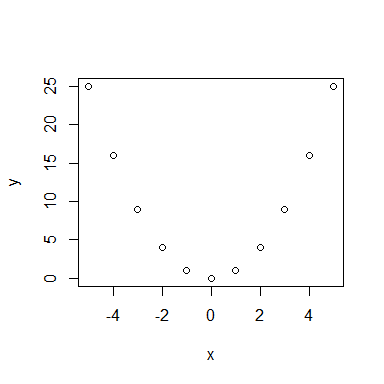
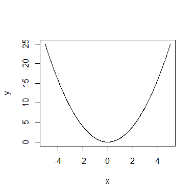
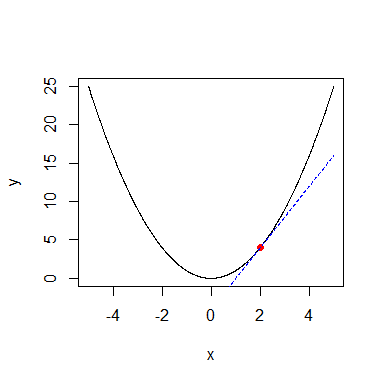
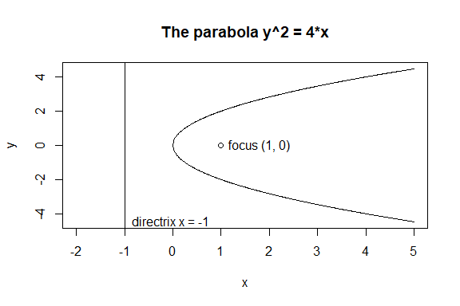

Input and Output
================

### Text

R에서 문자열은 다양한 방식으로 조작할 수 있으며, 숫자 데이터와 유사하게
벡터 및 행렬 형태로 사용할 수 있다.

- 문자열은 R에서 character mode의 데이터 타입을 가진다.
- 문자열은 큰따옴표 `"` 또는 작은따옴표 `'`로 둘러싸여 표현된다.
- 문자열은 숫자처럼 벡터와 행렬로 배열할 수 있다.
- `paste(..., sep)` 함수를 사용하여 문자열을 연결할 수 있다.

``` r
x <- "Citroen SM"
y <- "Jaguar XK150"
z <- "Ford Falcon GT-HO"
(wish.list <- paste(x, y, z, sep=", "))
```

    ## [1] "Citroen SM, Jaguar XK150, Ford Falcon GT-HO"

- escape 문자 `'\'`를 사용한 특수 문자.
  - `'\n'`은 줄 바꿈, `'\t'`는 탭, `'\b'`는 백스페이스, `'\"'`는
    큰따옴표 “, `'\\'`는 백슬래시 의미한다.
- 만약 문자열 `x`가 숫자로 이해될 수 있다면, `as.numeric(x)`를 사용하여
  숫자로 변환할 수 있다.

``` r
as.numeric("10.1")
```

    ## [1] 10.1

- `as.character(x)` 로 문자를 숫자로 변환할 수 있다.

``` r
as.character(10.1)
```

    ## [1] "10.1"

`paste0(..., )`는 `paste(..., sep = "", )`와 같다.

``` r
paste0("a","b","c")
```

    ## [1] "abc"

``` r
paste("a","b","c")
```

    ## [1] "a b c"

### Input from a file

- R은 파일에서 데이터를 읽는 여러 가지 방법을 제공한다.

  - `scan` 함수가 가장 유연한 방법이다.

  - `scan`을 사용하여 파일에서 값의 벡터를 읽는다.

- `scan(file= "", what=0, n=-1, sep="", skip=0, quiet=FALSE)`

  - 모든 매개변수는 선택 사항이다.

  - `file`은 읽어올 파일을 지정한다.

    - 기본값 `""`는 키보드로부터 입력을 읽음을 나타낸다.

  - `what`은 읽을 데이터의 모드 예시를 제공한다.

    - 숫자 값을 위해 `0`을 사용하고, 문자 데이터를 위해 `""`를 사용하라.

  - `n`은 읽을 요소의 수를 지정한다.

    - `n = -1`이면 scan은 EOF까지 계속 읽는다.

  - `sep`은 값들을 구분하는 데 사용되는 구분자를 지정할 수 있게 한다.
    예를 들어 `","`.

  - `skip`은 읽기 시작하기 전에 건너뛸 줄의 수를 나타낸다.

  - `quiet`는 scan이 몇 개의 값을 읽었는지 보고할지 여부를 제어한다.

#### Example : file input

다음 코드는 `data1.txt` 파일을 읽어서 quantile을 계산한다.

``` r
# 파일의 경로를 올바르게 설정한다.
#현재 working dir의 하위 디렉토리인 data에 data1.txt 파일이 위치치
data <- scan(file="data/data1.txt") 
print(data)
```

    ##  [1] 8 9 3 1 2 0 7 4 5 6

``` r
n <- length(data)

data.sort <- sort(data)
data.1qrt <- data.sort[ceiling(n/4)]
data.med <- data.sort[ceiling(n/2)]
data.3qrt <- data.sort[ceiling(3*n/4)]

cat("1st Quartile:", data.1qrt, "\n")
```

    ## 1st Quartile: 2

``` r
cat("Median:      ", data.med, "\n")
```

    ## Median:       4

``` r
cat("3rd Quartile:", data.3qrt, "\n")
```

    ## 3rd Quartile: 7

내장 함수 `quantile`을 사용하여 보자. `type`에 따라 quantile의 정의가
조금씩 다르다.

``` r
quantile( scan("data/data1.txt"), (0:4)/4 )
```

    ##   0%  25%  50%  75% 100% 
    ## 0.00 2.25 4.50 6.75 9.00

``` r
quantile( scan("data/data1.txt"), (0:4)/4, type = 1 )
```

    ##   0%  25%  50%  75% 100% 
    ##    0    2    4    7    9

``` r
quantile( scan("data/data1.txt"), (0:4)/4, type = 2 )
```

    ##   0%  25%  50%  75% 100% 
    ##  0.0  2.0  4.5  7.0  9.0

### Input from the keyboard

`scan` 함수는 `file`이 `""`일 때 키보드로부터 입력을 읽는 데 사용할 수
있다.

``` r
scan(file="", what="")   # character input
scan(file="", what=0)   # numeric input
```

`readline(prompt)`는 키보드로부터 한 줄의 텍스트를 읽는다.

`prompt` (기본값 `""`) : 선택적인 문자 입력을 받는다.

``` r
your_name <- readline("Input your name : ")
print(paste0("Your name is ", your_name, "."))
```

#### Example : Root of quadratic

예전에 살펴보았던 2차 방정식 문제를 계수를 직접 입력받아 코드를 작성해
보자.1

``` r
cat("find zeros of a2*x^2 +a1*x +a0 = 0\n")

# readline으로 읽으면 
a2 <- as.numeric(readline("a2= "))
a1 <- as.numeric(readline("a1= "))
a0 <- as.numeric(readline("a0= "))

discrim <- a1^2 - 4*a2*a0

if (discrim > 0) {
  roots <- (-a1 + c(1,-1) * sqrt(a1^2 - 4*a2*a0))/(2*a2)
} else if (discrim == 0) {
  roots <- -a1/(2*a2)
} else {
  roots <- c()
}

if (length(roots) == 0){ 
  cat("no root\n") 
} else if (length(roots)==1){ 
  cat("single root at", roots, "\n")
} else{  
  cat("roots at", roots[1], "and", roots[2], "\n")
}
```

#### Example : from web

웹 상의 파일을 읽어볼 수 있다.

- `what = ""`는 문자열로 읽는 것을 의미

``` r
url <- "https://raw.githubusercontent.com/ksublee/emhawkes/refs/heads/master/NEWS.md"
text <- scan(url, what="", sep="\n")
print(text)
```

    ##  [1] "# emhawkes 0.9.7"                                                                                                                                                                                
    ##  [2] "Fixed some bugs, improved efficiency in this version and several features have been added."                                                                                                      
    ##  [3] "## Breaking changes"                                                                                                                                                                             
    ##  [4] "* The `lambda0` argument name used in previous versions has been changed to `lambda_component0` in this version. This is to clearly indicate the meaning of the argument and to avoid confusion."
    ##  [5] "* The name of method `vol` is changed to `hvol` and this feature is currently experimental."                                                                                                     
    ##  [6] "* The Vignette file contains more examples and explanations."                                                                                                                                    
    ##  [7] "# emhawkes 0.9.6"                                                                                                                                                                                
    ##  [8] "Fixed some bugs, improved efficiency in this version and several features have been added."                                                                                                      
    ##  [9] "## Breaking changes"                                                                                                                                                                             
    ## [10] "* Slot `eta` is introduced which represents the constant part of `impact`."                                                                                                                      
    ## [11] "* The concepts of `rambda` and `rambda_component` are introduced. They are closely related to the right-continuous version of the intensity process."                                            
    ## [12] "* For inference of intensity and goodness of fit, `infer_lambda` and `residual_process` functions are implemented."                                                                              
    ## [13] "* The method `vol` to measure the volatility is introduced and this feature is currently experimental."

`readLines` 함수를 이용할 수도 있다.

``` r
readLines(url)
```

    ##  [1] "# emhawkes 0.9.7"                                                                                                                                                                                
    ##  [2] ""                                                                                                                                                                                                
    ##  [3] "Fixed some bugs, improved efficiency in this version and several features have been added."                                                                                                      
    ##  [4] ""                                                                                                                                                                                                
    ##  [5] "## Breaking changes"                                                                                                                                                                             
    ##  [6] ""                                                                                                                                                                                                
    ##  [7] "* The `lambda0` argument name used in previous versions has been changed to `lambda_component0` in this version. This is to clearly indicate the meaning of the argument and to avoid confusion."
    ##  [8] ""                                                                                                                                                                                                
    ##  [9] "* The name of method `vol` is changed to `hvol` and this feature is currently experimental."                                                                                                     
    ## [10] ""                                                                                                                                                                                                
    ## [11] "* The Vignette file contains more examples and explanations."                                                                                                                                    
    ## [12] ""                                                                                                                                                                                                
    ## [13] ""                                                                                                                                                                                                
    ## [14] "# emhawkes 0.9.6"                                                                                                                                                                                
    ## [15] ""                                                                                                                                                                                                
    ## [16] "Fixed some bugs, improved efficiency in this version and several features have been added."                                                                                                      
    ## [17] ""                                                                                                                                                                                                
    ## [18] "## Breaking changes"                                                                                                                                                                             
    ## [19] ""                                                                                                                                                                                                
    ## [20] "* Slot `eta` is introduced which represents the constant part of `impact`."                                                                                                                      
    ## [21] ""                                                                                                                                                                                                
    ## [22] "* The concepts of `rambda` and `rambda_component` are introduced. They are closely related to the right-continuous version of the intensity process."                                            
    ## [23] ""                                                                                                                                                                                                
    ## [24] "* For inference of intensity and goodness of fit, `infer_lambda` and `residual_process` functions are implemented."                                                                              
    ## [25] ""                                                                                                                                                                                                
    ## [26] "* The method `vol` to measure the volatility is introduced and this feature is currently experimental."                                                                                          
    ## [27] ""                                                                                                                                                                                                
    ## [28] ""                                                                                                                                                                                                
    ## [29] ""

### Output to a file

R에는 파일에 기록하는 다양한 방법이 있다.

- 일반적으로 숫자를 기록할 때는 `write` 또는 `write.table`을 사용한다.

- `cat`은 텍스트 또는 숫자와 텍스트의 조합을 쓸 때 사용한다.

- `write(x, file = "data", ncolumns = if(is.character(x)) 1 else 5, append = FALSE)`

  - `x`는 작성할 벡터이다.

    - `x`가 행렬인 경우 열 단위로 벡터로 변환된다.

  - `file`은 작성할 파일을 문자열로 지정한다.

    - 기본값 `"data"`는 현재 작업 디렉토리에 data라는 파일로 작성한다.

    - 화면에 쓰려면 `file=""`을 사용하라.

  - `ncolumns`: 데이터를 작성할 열의 수를 지정한다.

  - `append`는 파일에 추가할지 덮어쓸지를 나타낸다.

- `write`는 행렬을 벡터로 변환한다.

- R은 행렬을 열 단위로 저장하므로, 출력이 행렬 구조를 반영하도록 하려면
  행렬을 `write`하기 전에 `t`를 이용하여 전치(transpose)해야 한다.

``` r
( x <- matrix(1:24, nrow=4, ncol=6)) 
write(t(x), file = "out.txt", ncolumn=6)
```

### cat for writing to a file

`cat`은 더 유연한 명령으로 파일 출력에도 사용할 수 있다.

- `cat(..., file="", sep="", append=FALSE)`
  - `...`는 쉼표로 구분된 표현식들의 리스트로, 이들은 문자형 문자열로
    강제 변환되어 연결된 후 작성된다.
  - `file`은 작성하거나 추가할 파일을 문자열로 지정한다.
    - 기본값 `""`는 화면에 출력할 때 사용.
  - `sep`은 객체들 사이에 삽입되는 문자열이다.
  - `append`는 파일에 추가할지 덮어쓸지를 나타낸다.

### dump

`dump` 함수는 R 객체를 텍스트 형식으로 저장하여, 이후에 `source` 함수를
통해 다시 R 세션으로 불러올 수 있도록 하는 기능을 제공한다.

이는 데이터와 객체를 R 스크립트의 형태로 저장하고 공유할 때 유용하다.

`dump`를 사용하면 객체의 구조와 데이터를 텍스트 파일로 저장할 수 있으며,
나중에 동일한 객체를 복원할 수 있다.

    dump(list, file = "dumpdata.R", append = FALSE, control = c("keepNA", "keepInteger"))

다음 코드는 `x` 행렬을 생성 후, `dump`하여 파일로 저장한 후에, `x`를
삭제하여 R 세션에서 제거한 후, `source`로 `x`를 복원한다.

``` r
x <- matrix(rep(1:5, 1:5), nrow=3, ncol=5)
dump("x", file="result.txt")
rm(x) # this removes x
source("result.txt")
x 
```

    ##      [,1] [,2] [,3] [,4] [,5]
    ## [1,]    1    3    4    4    5
    ## [2,]    2    3    4    5    5
    ## [3,]    2    3    4    5    5

정형 데이터를 파일로 입출력하는 방법은 추후에 더 자세히 살펴본다.

### Plotting

R을 통해 다양한 그래프를 작성할 수 있다.

이미 `plot(x, y, type)`를 살펴본 적이 있으며, 더 자세히 알아보자.

- 현재 플롯에 점을 추가하려면 `points(x, y)`를 사용하라.
- 선을 추가하려면 `lines(x, y)`를 사용하라.
- 수직선 또는 수평선을 추가하려면 `abline(v=xpos)` 또는
  `abline(h=ypos)`를 사용하라.
- `points`와 `lines`는 색상을 결정하는 선택적 입력 `col`을 가진다.
  - `colors()`를 사용하면 색상의 전체 목록을 볼 수 있다.
- `(x[i], y[i])` 위치에 텍스트 `labels[1]`을 추가하려면
  `text(x, y, labels)`를 사용하라.
  - `pos`는 위치를 나타내는 데 사용된다. (`help(text)`를 참조하라)
- 제목을 추가하려면 `title(main)`을 사용하라. (`main`은 문자열이다.)

#### Example : Basic plot

다양한 `plot` 기능을 예제들을 통하여 살펴보자.

``` r
x <- seq(-5, 5, by = 1)
y <- x^2
plot(x, y)
```

<!-- -->

``` r
x <- seq(-5, 5, by = 1)
y <- x^2
plot(x, y, type = 'l') # line으로 그리기
```

<!-- -->

``` r
x <- seq(-5, 5, by = 0.01)
y <- x^2
plot(x, y, type = 'l')  #line
```

<!-- -->

``` r
x <- seq(-5, 5, by = 0.01)
y <- x^2
plot(x, y, type = 'l')
# add another line
lines(x, - x^2 + 25)
```

<!-- -->

``` r
x <- seq(-5, 5, by = 0.01)
y <- x^2
plot(x, y, type = 'l')

# x=2, y=4에서의 접점 표시
points(2, 2^2, col = "red", pch = 19)

# 접선 추가
tangent_line <- 4 * (x - 2) + 4
lines(x, tangent_line, col = "blue", lty = 2)
```

<!-- -->

#### Example : plotting a parabola $y^2=4x$

이 R 코드는 2차원 평면에 포물선 $y^2 = 4x$의 그래프를 그리는
스크립트이다

포물선은 초점과 준선으로부터 거리가 동일한 점들의 집합이다.

``` r
x <- seq(0, 5, by=0.01)
y.upper <- 2*sqrt(x)
y.lower <- -2*sqrt(x)
y.max <- max(y.upper)
y.min <- min(y.lower)

plot(c(-2,5), c(y.min, y.max), type="n", xlab="x", ylab="y")
lines(x, y.upper)
lines(x, y.lower)
abline(v=-1)  # 포물선의 준선
points(1,0)   # 포물선의 초점
text(1, 0, "focus (1, 0)", pos=4)
text(-1, y.min, "directrix x = -1", pos=4)

title("The parabola y^2 = 4*x")
```

<!-- -->

#### more than one plots

여러 개의 그림을 그려보자.

`par(mfrow = c(nr, nc))` 또는 `par(mfcol = c(nr, nc))`는 플롯의 격자를
생성한다.

- `mfrow = c(nr, nc)`: `nr`개의 행과 `nc`개의 열로 구성되며, 행 단위로
  채워진다.

- `mfcol = c(nr, nc)`: 열 단위로 채워진다.

`curve(expr, from, to, n)` 함수는 R에서 수학적 표현식 `expr` 을 기반으로
곡선을 그리는 데 사용한다.

- `expr`: 그릴 수학적 표현식을 지정한다. 이 표현식은 `x` 변수에 대한
  함수 형태로 작성해야 한다.

``` r
par(mfrow=c(2,2))
curve(x*sin(x), from=0, to=100, n=1001)
curve(x*sin(x), from=0, to=10, n=1001)
curve(x*sin(x), from=0, to=1, n=1001)
curve(x*sin(x), from=0, to=0.1, n=1001)
```

<!-- -->
