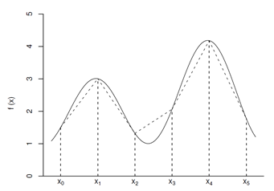
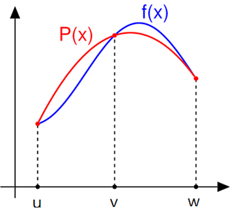
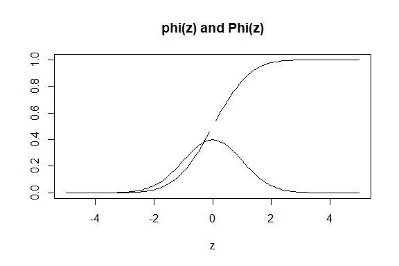

Numerical integration
================

## Introduction

다음과 같은 적분을 종종 계산할 필요가 있다.

$$ \int_a^b f(x) dx $$

만약 부정적분인 $F$를 알고 있다면

$$ \int_a^b f(x) dx  = F(b) - F(a)$$

- 그러나 많은 함수 f에 대해, 우리는 부정적분의 공식(closed form)을 알지
  못한다.

- 이러한 경우 우리는 나뉜 부분 구간에서 적분을 근사한다:

$$ a=x_0, x_1, \cdots, x_{n-1}, x_n = b $$

## Rectagular method

직사각형들을 이용하여 수치 적분을 하는 방법을 다시 살펴 보자.

``` r
rect <- function(ftn, a, b, n = 100){
  h <- (b-a)/n
  x.vec <- seq(a, b-h, by = h)
  f.vec <- sapply(x.vec, ftn)
  
  # 이 부분을 위 방법과 비교해 보라.
  h * sum(f.vec)
}
```

``` r
ftn6 <- function(x) 4*x^3
rect(ftn6, 0, 1)
```

    ## [1] 0.9801

- $f(x) = 4 x^3$의 0부터 1까지의 실제 적분을 수행해 보고, 위 근사값과
  비교해 보라.

## Trapzoidal rule

부분 구간 $[x_i, x_{i+1}]$에서 $y=f(x)$ 아래의 넓이를 사다리꼴로
근사하는 방법:



각 사다리꼴의 넓이:

$$ \frac{h}{2}(f(x_i) + f(x_{i+1})) \textrm{ where } h = x_{i+1} - x_i $$

사다리꼴(Trapezoidal) 근사:

$$ T = \frac{h}{2} (f(x_0) + 2f(x_1) + \cdots + 2f(x_{n-1}) + f(x_n))$$

``` r
trapezoid <- function(ftn, a, b, n = 100) {
  h <- (b-a)/n
  x.vec <- seq(a, b, by = h)
  f.vec <- sapply(x.vec, ftn)
  
  # 이 부분을 위 방법과 비교해 보라.
  h*(f.vec[1]/2 + sum(f.vec[2:n]) + f.vec[n+1]/2)
}
```

``` r
ftn6 <- function(x) return(4*x^3)
trapezoid(ftn6, 0, 1, n=20)
```

    ## [1] 1.0025

## Simpson’s rule

Simpson’s rule은 구간 $[a,b]$를 $n$개의 (짝수) 부분 구간으로 나눈다.

그리고 $f$를 포물선(2차 다항식)으로 근사한다.

$$  P(x) = f(u) \frac{(x-v)(x-w)}{(u-v)(u-w)} + f(v) \frac{(x-u)(x-w)}{(v-u)(v-w)} + f(w) \frac{(x-u)(x-v)}{(w-u)(w-v)}  $$

넓이의 근사값으로 우리는 다음을 사용한다:

$$ \int_v^w P(x) dx = \frac{h}{3}(f(u) + 4f(v) + f(w)) $$



이제 $n$이 짝수라고 가정하고, 부분 구간 $[x_{2i}, x_{2i+2}]$에 대한
근사값을 합하여 Simpson 근사값 $S$를 얻는다.

$$ S = \frac{h}{3}(f(x_0) + 4f(x_1) + 2f(x_2) + 4f(x_3) + 2f(x_4) \cdots + 2f(x_{n-2}) + 4f(x_{n-1}) + f(x_n)) $$

인덱스 $i$가 홀수일 때의 $f(x_i)$는 모두 4의 가중치를 가지며, $i$가
짝수일 때의 $f(x_i)$ (0과 n 제외)는 2의 가중치를 가진다.

``` r
simpson_n <- function(ftn, a, b, n = 100) {
  n <- max(c(2*(n %/% 2), 4))
  h <- (b-a)/n
  x.vec1 <- seq(a+h, b-h, by = 2*h)
  x.vec2 <- seq(a+2*h, b-2*h, by = 2*h)
  f.vec1 <- sapply(x.vec1, ftn)
  f.vec2 <- sapply(x.vec2, ftn)
  h/3*(ftn(a) + ftn(b) + 4*sum(f.vec1) + 2*sum(f.vec2))   # return value
}
```

``` r
# or similarly
simpson_n <- function(ftn, a, b, n = 100) {
  n <- max(c(2*(n %/% 2), 4))
  h <- (b-a)/n
  
  x.vec <- seq(a, b, by = h)
  f.vec <- sapply(x.vec, ftn)
  
  # 이 부분을 위 방법과 비교해 보라.
  h * 1/3 * (f.vec[1] + 4 * sum(f.vec[seq(2, n, by=2)]) + 2 * sum(f.vec[seq(3, n-1, by=2)]) + f.vec[n+1])
  
}
```

Example:

``` r
ftn6 <- function(x) return(4*x^3)
simpson_n(ftn6, 0, 1, 20)
```

    ## [1] 1

#### Example : probability density function

가상의 확률밀도함수 `f`를 살펴보자.

``` r
f <- function(x) {
  if (0 < x & x < 1) 1/simpson_n(function(x) exp(-x^3), 0, 1)*exp(-x^3)
  else 0
}

plot(seq(-1,2,0.01), sapply(seq(-1,2,0.01), f), xlab="x", ylab="f(x)", 'l')
```

<!-- -->

평균 계산:

``` r
(m <- simpson_n(function(x) x*f(x), 0, 1))
```

    ## [1] 0.4317834

분산 계산:

``` r
simpson_n(function(x) (x-m)^2*f(x), 0, 1)
```

    ## [1] 0.0719255

Exercise: 누적 분포 함수 $F(x)$를 어떻게 정의할 수 있겠는가?

### pdf and cdf of the standard normal

표준 정규 분포의 확률 밀도 함수와 누적 분포를 고려해 보자.

``` r
# probability density function
phi <- function(x) exp(- x ^ 2 / 2) / sqrt(2 * pi)

# cumulative distribution function
Phi <- function(z) {
  if (z < 0) 0.5 - simpson_n(phi, z, 0)
  else 0.5 + simpson_n(phi, 0, z)
}

z <- seq(-5, 5, by = 0.1)
phi.z <- sapply(z, phi)
Phi.z <- sapply(z, Phi)
plot(z, Phi.z, type = "l", ylab = "", main = "phi(z) and Phi(z)")
lines(z, phi.z)
```

<!-- -->

Exercise: 왜 $\Phi$의 그래프가 깨졌는가? 어떻게 고칠 수 있는가?

### Functional programming

위 과정을 다시 살펴보면 수치적분의 반환 값은 아래 설명에서의 `f.vec`에
의해 결정됨을 알 수 있다.

- 직사각형 방법: `h * sum(f.vec)`

- 사다리꼴 방법: `h * (f.vec[1]/2 + sum(f.vec[2:n]) + f.vec[n+1]/2)`

- Simpson’s rule:
  `h * 1/3 * (f.vec[1] + 4 * sum(f.vec[seq(2, n, by=2)]) + 2 * sum(f.vec[seq(3, n-1, by=2)]) + f.vec[n+1])`

`h` 다음에 있는 계산 파트들을 각각 함수로 정의할 수 있다.

``` r
rect_method <- function(f.vec) sum(f.vec)

trapz_method <- function(f.vec) {
  n <- length(f.vec) - 1
  f.vec[1]/2 + sum(f.vec[2:n]) + f.vec[n+1]/2
}

simpson_method <- function(f.vec) {
  n <- length(f.vec) - 1
  (f.vec[1] +
    4 * sum(f.vec[seq(2, n, by=2)]) +
    2 * sum(f.vec[seq(3, n-1, by=2)]) +
    f.vec[n+1]) / 3
}
```

이제 일반적인 수치적분 함수를 정의할 수 있다.

``` r
numerical_int <- function(ftn, a, b, n = 100, method){
  
  n <- max(c(2*(n %/% 2), 4))
  h <- (b-a)/n
  x.vec <- seq(a, b, by = h)
  f.vec <- sapply(x.vec, ftn)
  
  h * method(f.vec)
}
```

``` r
ftn6 <- function(x) return(4*x^3)
```

``` r
numerical_int(ftn6, 0, 1, method = rect_method)
```

    ## [1] 1.0201

``` r
numerical_int(ftn6, 0, 1, method = trapz_method)
```

    ## [1] 1.0001

``` r
numerical_int(ftn6, 0, 1, method = simpson_method)
```

    ## [1] 1

이 프로그래밍 방식은 새로운 방법이 구현될 때 수치적분을 확장할 수 있게
해준다.

예를 들어, Milne 방법은 Simpson 방법과 비슷하나 조금 다른 근사법을
사용한다:


$$ \int_u^w P(x) dx = \frac{h}{3} (4f(u) -2f(v) + 4f(w)) $$

``` r
milne_method <- function(f.vec) {
  n <- length(f.vec) - 1
  (4 * f.vec[1] +
    (-2) * sum(f.vec[seq(2, n, by=2)]) +
    8 * sum(f.vec[seq(3, n-1, by=2)]) +
    4 * f.vec[n+1]) * 1 / 3
}
```

``` r
numerical_int(ftn6, 0, 1, method = milne_method)
```

    ## [1] 1.0006

More about functional programming :
<http://adv-r.had.co.nz/Functional-programming.html>
