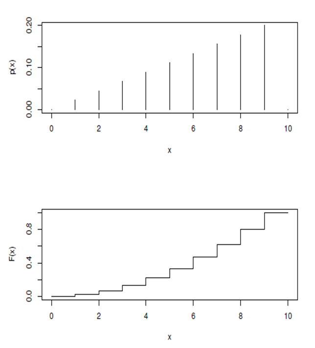
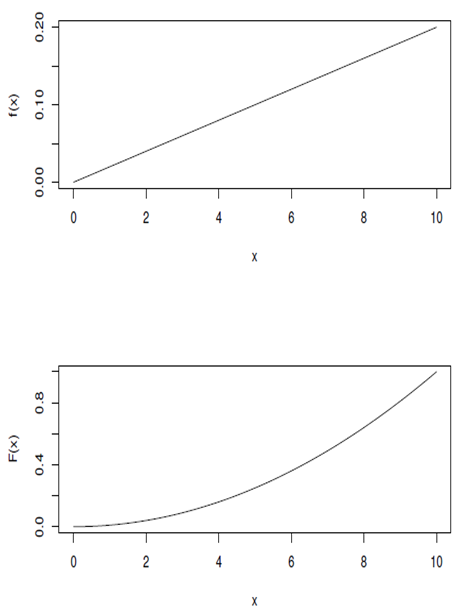
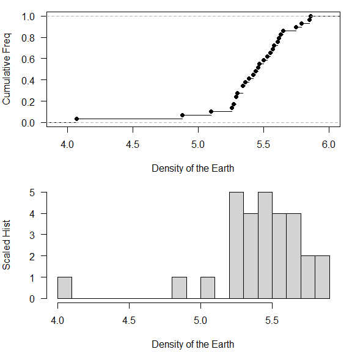
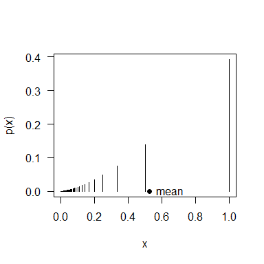

Random variable
================

## Random variable

- 표본 공간 $\Omega$와 사건을 $[0, 1]$ 구간으로 대응시키는 확률 측도
  $\mathbb{P}$가 있다고 하자.

- 확률 변수 $X$는 $\Omega$에서 실수 집합 $\mathbb{R}$로의 함수이다. 즉,
  확률 변수는 $\Omega$의 각 결과에 대해 연관된 값이다.

- $\mathbb{P}(X = x)$를 사건 $\{\omega \in \Omega : X(\omega) = x\}$의
  확률이라고 정의하라.

- 보다 일반적으로,
  $\mathbb{P}(X \in A) = \mathbb{P}(\{\omega \in \Omega : X(\omega) \in A\})$라고
  정의한다.

- 이제 $\{X \in A\}$를 $\{\omega \in \Omega : X(\omega) \in A\}$의
  약칭으로 사용하겠다.

### Example of random variable

공정한 동전을 세 번 던진다고 하자.

- $X$를 첫 번째 꼬리(T)가 나올 때까지의 앞면(H)의 수라고 정의하자.
- $Y$를 전체 앞면(H)의 수라고 정의하자.
- $\omega$를 $\Omega$의 원소라고 하자.

| $\omega$             | HHH | HHT | HTH | HTT | THH | THT | TTH | TTT |
|:---------------------|:----|:----|:----|:----|:----|:----|:----|:----|
| $\mathbb{P}(\omega)$ | 1/8 | 1/8 | 1/8 | 1/8 | 1/8 | 1/8 | 1/8 | 1/8 |
| $X$                  | 3   | 2   | 1   | 1   | 0   | 0   | 0   | 0   |
| $Y$                  | 3   | 2   | 2   | 1   | 2   | 1   | 1   | 0   |

따라서, 다음과 같이 확률을 계산한다:

$\mathbb{P}(X = 0) = \mathbb{P}({THH, THT, TTH, TTT}) = \frac{1}{2}$.
$\mathbb{P}(Y = 0) = \mathbb{P}({TTT}) = \frac{1}{8}$.

### Properties of random variable

확률 변수의 중요한 개념 중 하나는 $\Omega$를 설명하지 않고도 사건의
발생과 그 확률에 대해 설명할 수 있다는 것이다.

이를 위해 확률 변수의 누적 분포 함수(cdf)를 사용한다:
$F(x) = \mathbb{P}(X \leq x)$

만약 $a < b$라면 $F(a) \leq F(b)$이므로, $F$는 비감소 함수가 된다.

또한 $x \to -\infty$일 때 $F(x) \to 0$이고, $x \to \infty$일 때
$F(x) \to 1$인 것도 사실이다.

### Discrete random variable

만약 분포 함수가 계단 함수라면, 그 확률 변수는 이산형이라고 부른다.

이산 확률 변수는 보통 ‘확률 질량’ 함수 $p(x)$로 해석한다:

$$p(x) = \mathbb{P}(X = x)$$



### Continuous random variable

만약 분포 함수가 어떤 함수(밀도 함수라고 불리는)의 적분이라면, 그 확률
변수는 연속형이라고 부른다.

누적 분포 함수(cdf)는 다음과 같이 쓸 수 있다:

$$F(y) = \mathbb{P}(Y \leq y) = \int_{-\infty}^{y} f(u) \, du$$

여기서 $f$는 확률 밀도 함수이다.

또한 $F'(y) = f(y)$이다.

$f(y)$를 다음과 같이 생각할 수 있다:

$$\mathbb{P}(y < Y < y + dy) = f(y) \, dy$$



### Independent random variables

확률 변수 $X$와 $Y$가 독립이라는 것은 $X$를 사용하여 정의된 어떤 사건도
$Y$를 사용하여 정의된 어떤 사건과 독립임을 의미한다.

즉, 임의의 집합 $A$와 $B$에 대해, 사건 $\{X \in A\}$와 $\{Y \in B\}$는
독립이다.

쉽게 표현하자면, $X$와 $Y$가 독립이라는 것은 $X$의 값을 아는 것이 $Y$에
대해 새로운 정보를 제공하지 않는다는 것을 의미한다.

### Random sample

분포 $F$에서의 랜덤 표본은 서로 독립인 확률 변수들의 수열
$X_1, X_2, \cdots, X_n$으로, 모두 같은 분포 함수 $F$를 가진다.

랜덤 표본이 주어졌을 때, 임의의 $x$에 대해 경험적 분포 함수
$\hat{F}(x)$를 사용하여 $F(x)$를 근사할 수 있다:

$\hat{F}(x) = \frac{|\{X_i \leq x\}|}{n}$.

만약 $F$가 이산 분포에서 왔다면, 다음을 사용하여 $p(x)$를 추정할 수
있다:

$\hat{p}(x) = \frac{|\{X_i = x\}|}{n}$.

표본 크기 $n \to \infty$일 때, $\hat{F}(x) \to F(x)$ 그리고
$\hat{p}(x) \to p(x)$가 된다.

### Estimate density

스케일된 히스토그램을 사용하여 밀도를 추정할 수 있다.

작은 $\delta$에 대해,
$F'(x) \approx \frac{F(x+\delta) - F(x)}{\delta}$이므로,

$$
\hat{f}_k = \frac{|\{i : k\delta < x_i < (k+1)\delta\}|}{n\delta} = \frac{\hat{F}((k+1)\delta) - \hat{F}(k\delta)}{\delta} \approx f(k\delta)
$$

구간 $(k\delta, (k+1)\delta]$을 보통 계급구간(bin)이라고 부른다.

#### Example : Cavendish’s experiment

지구의 밀도에 대한 29개의 측정값:

``` r
cavendish <- c(5.5, 5.57, 5.42, 5.61, 5.53, 5.47, 4.88, 5.62, 5.63, 4.07, 5.29, 5.34, 5.26, 5.44, 5.46, 5.55, 5.34, 5.3, 5.36, 5.79, 5.75, 5.29, 5.1, 5.86, 5.58, 5.27, 5.85, 5.65, 5.39)
```

측정값에는 오차가 있을 수 있으며, 이는 랜덤으로 간주된다.

R은 경험적 누적 분포 함수 `ecdf`와 스케일된 히스토그램을 그리는 데
유용한 내장 함수를 제공한다.

``` r
opar <- par(mfrow=c(2,1), las=1, mar=c(4.2,4,1,1))
plot(ecdf(cavendish), xlab="Density of the Earth", ylab="Cumulative Freq", main="")
hist(cavendish, freq=TRUE, breaks=20, xlab="Density of the Earth", ylab="Scaled Hist", main="")
```

<!-- -->

### Expectation and finite approximation

확률 변수 $X$의 기대값 또는 평균:

- $X$가 이산형일 때: $\mathbb{E}X = \sum_{x} x p(x)$
- $X$가 연속형일 때: $\mathbb{E}X = \int x f(x) \, dx$

기대값은 표본 평균의 이론적 대응값이다.

$X$가 확률 질량 함수(pmf) $p$를 가지는 이산 확률 변수라고 가정하고,
$X_1, \ldots, X_n$이 독립이고 동일한 분포(iid)를 가지며 pmf $p$를 가지는
표본이라고 하자. 그러면

$$
\mathbb{E}X = \sum_{x} x p(x) \approx \sum_{x} x \frac{|\{X_i = x\}|}{n} = \frac{1}{n} \sum_{i=1}^{n} X_i = \bar{X}
$$

표본 평균은 $n \to \infty$일 때 기대값으로 수렴한다.

#### Example: numerical calculation of the mean

확률 질량 함수 \$ p(x) = c x^{3/2} \$를 사용하여 기대값
$\mathbb{E}[X]$를 계산하라.

여기서 \$ x = 1, , , , \$이며 $c$는 다음 조건을 만족한다:

$$
c \sum_{k=1}^{1000} \left( \frac{1}{k} \right)^{3/2} = 1
$$

``` r
x <- 1/(1000:1)              # possible values for X
pX <- x^1.5                  # probability mass ftn
pX <- pX/sum(pX)             # must have sum(pX) == 1
muX <- sum(x*pX)             # mean
```

``` r
# plot the pmf and mean
par(las=1)
plot(c(0, 1), c(0, max(pX)), type="n", xlab="x", ylab="p(x)")
lines(x, pX, type="h")
points(muX, 0, pch=19)
text(muX, 0, "mean", pos=4)
```

<!-- -->

#### Example : truncated normal

$X$가 $(0, 1)$로 절단된 정규 밀도를 가진다. 즉, 어떤 상수 $c$에 대해

$$
f(x) = c \exp\left(-\frac{x^2}{2}\right) \quad \text{for } x \in (0, 1)
$$

그리고 $f(x) = 0$은 그 외의 경우이다.

기대값 $\mathbb{E}X$를 계산하기 위해 Simpson 방법을 사용하라.

``` r
f <- function(x) exp(-x^2/2)

simpson_n <- function(ftn, a, b, n = 100) {
  n <- max(c(2*(n %/% 2), 4))
  h <- (b-a)/n
  
  x.vec <- seq(a, b, by = h)
  f.vec <- sapply(x.vec, ftn)
  
  h * 1/3 * (f.vec[1] + 4 * sum(f.vec[seq(2, n, by=2)]) + 2 * sum(f.vec[seq(3, n-1, by=2)]) + f.vec[n+1])
  
}
```

``` r
f <- function(x) exp(-x^2/2)
cc <- 1/simpson_n(f, 0 ,1)
xf <- function(x) x*f(x)
mu <- simpson_n(xf, 0, 1) * cc
cat('mean of X is ', mu, '\n')
```

    ## mean of X is  0.4598622

#### Example : Infinite range

확률 변수 $X$의 범위는 $X$가 취할 수 있는 값들의 집합이다, 즉
$\{x : X(\omega) \text{ for some } \omega \in \Omega\}$이다.

만약 $X$의 범위가 유계(finite)라면 $\mathbb{E}X$는 존재하고 유한하며,
수치적으로 계산하는 데 문제가 없다.

그러나 범위가 무계(infinite)라면, $\mathbb{E}X$는 무한할 수도 있고,
존재하지 않을 수도 있다.

대표적으로 Cauchy 분포는 평균과 분산이 정의되지 않으며, 이는 분포의
꼬리가 매우 두껍기 때문이다.

### Variance and standard deviation

확률 변수 $X$의 분산은 $\mathbb{E}(X - \mathbb{E}X)^2$이다.

- $X$의 표준 편차는 $\text{Var} \, (X)$의 제곱근이다.

- $\text{Var} \, (X) \geq 0$이다.

- $\text{Var} \, (X) = \mathbb{E}X^2 - (\mathbb{E}X)^2$이다.

- $\text{Var} \, (X) = 0$인 경우는 $X = \mu$ (상수)일 때뿐이다.

- $\text{Var} \, (aX + b) = a^2 \, \text{Var} \, X$ for any constant $a$
  and $b$이다.

- $\text{Var} \, (X + Y) = \text{Var} \, (X) + \text{Var} \, (Y) + \text{Cov}(X, Y)$이다.

  - 여기서 $\text{Cov}(X, Y) = \mathbb{E}(X - \mu_X)(Y - \mu_Y)$이다.

### Covariance

$X$와 $Y$의 공분산은 $X$와 $Y$가 함께 어떻게 변화하는지를 설명한다.

예를 들어, $Y$가 평균 이상일 때 $X$도 평균 이상인 경향이 있다면,
$\text{Cov}(X, Y)$는 양수가 되고 합의 분산은 증가한다. 우리는 $X$와
$Y$가 양의 상관관계가 있다고 한다.

비슷하게 음의 상관관계를 가지는 확률 변수도 있다.

$\text{Cov}(X, Y) = 0$이면 $X$와 $Y$는 상관관계가 없다.

독립인 확률 변수는 상관관계가 없다.

상관 계수:

$$
\rho(X, Y) = \frac{\text{Cov}(X, Y)}{\sqrt{\text{Var}(X) \text{Var}(Y)}}
$$

### Estimator of mean

$X_1, \ldots, X_n$이 평균 $\mu$와 분산 $\sigma^2$를 가지는 독립이고
동일한 분포(iid)를 따르는 랜덤 표본이라고 하자.

통계학에서 $\bar{X}$는 $\mu$의 추정량이라고 하며, 때때로 $\hat{\mu}$로
표기한다.

만약 $x_i$가 $X_i$의 관측값이라면,
$\bar{x} = \left(\sum_{i=1}^{n} x_i \right)/n$은 $\mu$의 점 추정량이라고
한다.

다음과 같은 식을 가진다:

$$
\mathbb{E}\bar{X} = \mathbb{E}\left(\frac{X_1}{n} + \cdots + \frac{X_n}{n}\right) = \mu
$$

$$
\text{Var} \, \bar{X} = \text{Var}\left(\frac{X_1}{n} + \cdots + \frac{X_n}{n}\right) = \frac{\sigma^2}{n}
$$

### The weak law of large numbers

$X_1, \ldots, X_n$이 각각 평균 $\mu$와 유한한 분산을 가지는 독립이고
동일한 분포(iid)를 따르는 랜덤 표본이라고 하자. 그러면 임의의
$\epsilon > 0$에 대해,

$$
\mathbb{P}(|\bar{X} - \mu| > \epsilon) \rightarrow 0 \quad \text{as} \quad n \rightarrow \infty
$$

이는 즉, 허용 오차 $\epsilon$이 주어졌을 때, 표본 크기가 증가함에 따라
$\bar{X}$가 $\mu$로부터 $\epsilon$ 이내에 있을 확률이 원하는 만큼, 즉,
1에 가까워진다는 것을 의미한다.
