Discrete random variable
================

## Discrete random variable in R

R에는 일반적으로 사용되는 확률 분포를 다루는 내장 함수들이 있다.  
$X$가 매개변수 `p1`, `p2`, …를 가지는 분포 `dist`를 따를 때,

- `ddist(x, p1, p2, ...)`는 $X$가 이산형일 경우 $P(X=x)$를, 연속형일
  경우 $X$의 밀도를 나타낸다.

- `pdist(q, p1, p2, ...)`는 $P(X \leq q)$를 나타낸다.

- `qdist(p, p1, p2, ...)`는 $P(X \leq q) \geq p$가 되는 가장 작은 $q$를
  나타낸다 (100$p$%-포인트).

- `rdist(n, p1, p2, ...)`는 분포 유형 `dist`로부터 난수 벡터 `n`을
  생성한다.

`x`, `p`, `q`는 모두 벡터 값이 될 수 있으며, 이 경우 출력도 벡터 값이다.

## Some of the discrete distributions

R에서 제공하는 몇 가지 이산 분포와 관련 입력 매개변수의 이름은 다음과
같다.

| 분포   | R 이름 (`dist`) | 매개변수 이름 |
|:-------|:----------------|:--------------|
| 이항   | `binom`         | `size, prob`  |
| 기하   | `geom`          | `prob`        |
| 음이항 | `nbinom`        | `size, prob`  |
| 포아송 | `pois`          | `lambda`      |

이항 분포를 따르는 $X$에 대해 `size=10`, `prob=0.5`일 때 $P(X \leq 5)$는
다음과 같다.

``` r
pbinom(5, size = 10, prob = 0.5)
```

    ## [1] 0.6230469

## Bernoulli distribution

베르누이 확률 변수 $B$는 단일 실험에 기반한다.

- 실험이 성공하면 값 1을 가진다.
- 그렇지 않으면 0을 가진다.

베르누이 분포를 $B$ ~ $Bernoulli(p)$로 나타낸다.

- $P(B=x) = p$ (단, $x = 1$)이고 $P(B=x) = 1-p$ (단, $x = 0$)이다.
- $E[B] = p$이다.
- $Var(B) = p(1-p)$이다.

## Binomial distribution

$X$를 성공 확률이 $p$인 독립적인 $n$번의 실험에서의 성공 횟수라고 하자.

그러면 $X$는 매개변수 $n$과 $p$를 가지는 이항 분포를 따른다고 한다.

$B_1, \ldots, B_n$이 독립적인 $Bernoulli(p)$ 확률 변수라고 할 때,

- $X = B_1 + \cdots + B_n$ ~ $binom(n,p)$이다.

$x = 0, 1, \ldots, n$에 대해 다음을 만족한다:

$$
P(X = x) = {n \choose x} p^x (1-p)^{n-x}
$$

베르누이 분포는 $binom(1,p)$와 같다.

#### Probability mass function

이항분포의 확률 질량 함수, 즉, $P(X=x)$는 `dbinom`을 이용한다.

##### Usage

``` r
dbinom(x, size, prob, log=FALSE)
```

- `x`는 vector일 수 있다.

##### Example

``` r
dbinom(c(0,1,2,3,4,5), size=5, prob=0.4)
```

    ## [1] 0.07776 0.25920 0.34560 0.23040 0.07680 0.01024

#### Probability distirbution fuction

이항분포의 누적분포함수, 즉, $P(X \leq q)$는 `pbinom` 함수를 이용한다.

##### Usage

``` r
pbinom(q, size, prob, lower.tail = TRUE, log.p = FALSE)
```

- `q` 는 vector일 수 있다.

##### Example

``` r
pbinom(c(0,1,2,3,4,5), 5, 0.4)
```

    ## [1] 0.07776 0.33696 0.68256 0.91296 0.98976 1.00000

#### Quantile function

`qbinom` 함수는 이항분포의 quantile을 찾는 함수이다.

이는 주어진 확률 $p$에 대해, 누적확률이 $p$가 넘어서는 이항 확률변수
값들 중 가장 작은 값을 찾는다.

$$ \min { k \in \mathbb{N} : \mathbb P(X \leq k) \geq p } $$

##### Usage

``` r
qbinom(p, size, prob, lower.tail = TRUE, log.p = FALSE)
```

``` r
qbinom(0.7, size = 5, prob = 0.4)
```

#### Random number generator

이항분포를 따르는 난수를 생성할 때는 `rbinom`을 이용한다.

##### Usage

``` r
rbinom(n, size, prob)
```

- 이항 확률 변수의 `n`개의 관측값을 생성한다.

  - `size` : 이항분포에서 베르누이 실행 횟수
  - `prob` : 각 실행의 성공 확률

##### Example

이항 분포 $binom(10, 0.4)$에서 5개의 샘플을 생성한다.

``` r
rbinom(5, size = 10, prob = 0.4)
```

    ## [1] 3 5 3 1 4

`rbinom` 함수를 사용하여 베르누이 확률 변수를 생성할 수 있다.

``` r
# 이 문장을 반복 실행해 보자.
rbinom(1, size = 1, prob = 0.4)
```

    ## [1] 0

베르누이 확률 변수의 합은 이항 분포를 따른다.

``` r
# 이 문장을 반복 실행해 보자.
sum(rbinom(10, size = 1, prob = 0.4))
```

    ## [1] 4

``` r
# 위와 동일한 분포
rbinom(1, size = 10, prob = 0.4)
```

    ## [1] 3

### Binomial probability mass function

여러 parameter 값들에 따른 확률질량함수(probability mass function)들을
관찰해 보자.

``` r
par(mfrow=c(2, 2))
x <- seq(0, 20, 1)

ps <- c(0.5, 0.5, 0.2, 0.8)
trials <- c(10, 20, 10, 10)

for (i in seq(1,4)){
   y <- dbinom(x, trials[i], ps[i])
   plot(x,y,xlim=c(0, trials[i]), ylim=c(0,1), xlab="x", ylab="P(X=x)", type="h")
   points(x, y)
   title(paste0("binomial(", trials[i], "," , ps[i], ")"))
}
```

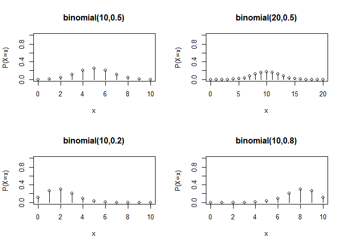<!-- -->

### Binomial probability distribution function

``` r
par(mfrow=c(2, 2))
x <- seq(0, 20, 1)

ps <- c(0.5, 0.5, 0.2, 0.8)
trials <- c(10, 20, 10, 10)

for (i in seq(1,4)){
   y <- pbinom(x, trials[i], ps[i])
   plot(x, y, xlim=c(0, trials[i]), ylim=c(0,1), xlab="x",
                           ylab="P(X<=x)", type="s")
   title( paste("binomial(", trials[i], ",", ps[i], ")") )
}
```

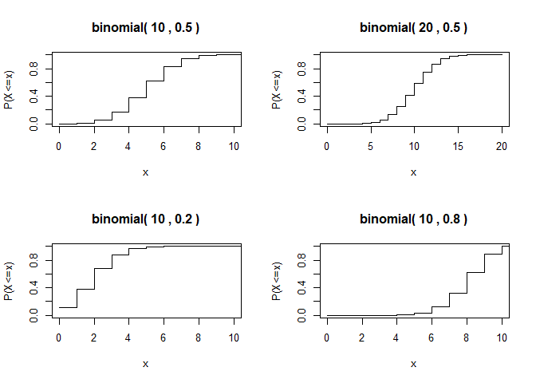<!-- -->

### Generate random variables

- `rbinom`을 이용하여 $N$개의 이항 확률 변수를 생성해 보자.

``` r
N <- 100; n <- 20; p <- 0.4
(brv <- rbinom(N, n, p) )
```

    ##   [1]  9  9 10  5 10  9  7  6 11  9 10  9  6  9  7  4  8 11  8  6  9  9  6  6  7
    ##  [26] 11  8  4  9  9 10  9  8  7  9 10 12  6  8  7  6  9  8 11  4  8  9 10  8  8
    ##  [51] 10 11  7  6 12  8  9  7  9 14  8  6  9  5  9  9 10  9  6  5  8  8  7  7  9
    ##  [76]  7  8  7  4  8  8  9  8  7  9  8 10  7  9  9  6 11  5  7 13 11  6  8 11  8

- `table` 을 이용하여 각 관찰값들의 빈도를 확인해 보자.

``` r
table(brv)
```

    ## brv
    ##  4  5  6  7  8  9 10 11 12 13 14 
    ##  4  4 12 14 20 25  9  8  2  1  1

- `factor` 함수를 이용하면, `levels`을 명시하여 다음과 같이 나타낼 수
  있다.

``` r
table(factor(brv, levels=0:20))
```

    ## 
    ##  0  1  2  3  4  5  6  7  8  9 10 11 12 13 14 15 16 17 18 19 20 
    ##  0  0  0  0  4  4 12 14 20 25  9  8  2  1  1  0  0  0  0  0  0

### Comparison between r.v. and pmf

표본의 크기 $N$이 크면, 확률 변수의 상대 빈도는 확률 질량 함수(pmf)와
유사하다.

``` r
N <- 500; n <- 20; p <- 0.4

frequency <- table(factor(rbinom(N, n, p), levels = 0:n))
relative_frequency <- as.numeric(frequency/N)

x <- 0:n
pmf <- dbinom(x, n, p)

par(mfrow=c(1,2))
plot(x, relative_frequency, 'h')
plot(x, pmf, 'h')
```

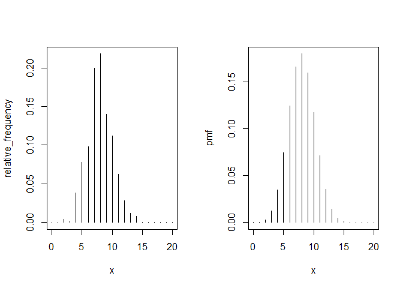<!-- -->

#### Example

고장률이 0.01일 때, 무작위로 선택된 1000개의 물품 중 20개 미만의 고장이
발생할 확률은 무엇인가?

$X$가 $p=0.01$의 이항확률변수일 때, $\mathbb P(X < 20)$을 구하는 것과
같다.

``` r
pbinom(19, size=1000, prob=0.01)
```

    ## [1] 0.9967116

## Geometric distribution

$B_1, B_2, \ldots$는 $Bernoulli(p)$ 확률 변수가 독립적으로 이루어진 무한
수열이라고 하자.

그리고 $Y$를 $B_1 = \cdots = B_Y = 0$이고 $B_{Y+1} = 1$인 확률률변수라고
하자.

그렇다면 $Y$는 매개변수 $p$를 가지는 기하 분포를 따른다고 한다.

$Y$는 첫 번째 성공이 나타나기 전까지의 시행 횟수를 나타낸다.

우리는 $Y$를 geom$(p)$로 표기하며, 다음과 같은 성질을 가진다:

- $P(Y=y) = p(1-p)^y$

- $E[Y] = \frac{1-p}{p}$

- $Var(Y) = \frac{1-p}{p^2}$

### Pmf of geometric distribution

``` r
par(mfrow=c(2,2))
x <- seq(0,20,1)
ps <- seq(0.2,0.8,0.2)
for (p in ps){
  y <- dgeom(x, p)
  plot(x, y, xlim=c(0,20), ylim=c(0,1), xlab="x", ylab="P(X=x)", type="h")
  points(x, y)
  title(paste("geometric(", p, ")"))
}
```

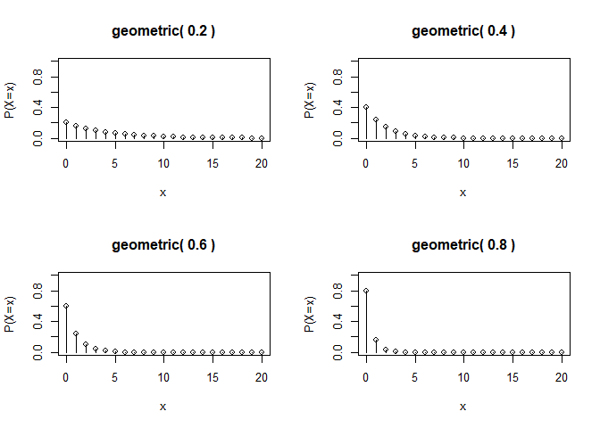<!-- -->

### Cdf of geometric distribution

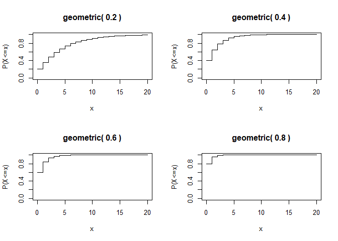<!-- -->

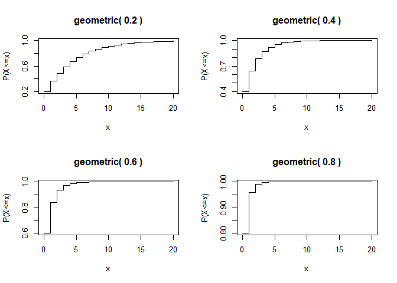<!-- -->

### Comparison with simulation

위에서 했던 것과 비슷하게, `rgeom`을 통해 생성된 기하확률변수의 샘플
히스토그램과 pmf를 비교하여 보자.

``` r
N <- 500; p <- 0.4; xmax <- 20

x <- 0:xmax; pmf <- dgeom(x, p)

frequency <- table(factor(rgeom(N, p), levels=x))   # generated by rgeom function
relative_frequency <- as.numeric(frequency/N)

par(mfrow=c(1,2))
plot(x, relative_frequency, 'h'); plot(x, pmf, 'h')
```

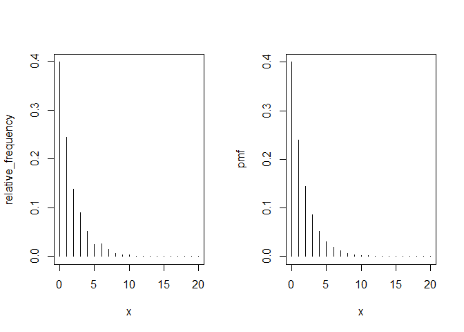<!-- -->

### Comparison with simulation based on Bernoulli trial

이번에는 `rgeom`이 아니라, 기하확률변수의 정의에 따라 베르누이 시행을
바탕으로 확률변수를 생성해 보자.

``` r
# repeat this procedure
n <- 0
while(TRUE){
  trial <- rbinom(1, 1, 0.4)  # Bernoulli trial
  if (trial == 1) break   # if trial is success, stop while
  n <- n + 1              # if trial is failure, increase number of trials
}
print(n)
```

    ## [1] 0

총 `N = 500`의 샘플을 생성해 보자.

``` r
N <- 500; p <- 0.4; xmax <- 20;

# generate random values from rbinom
geom_rv <- numeric(N)  # preallocation, zero vector with length N
for (i in 1:N){        # N is sample size
  n <- 0
  while(TRUE){
    trial <- rbinom(1, 1, p)  # Bernoulli trial
    if (trial == 1) break   # if trial is success, stop while
    n <- n + 1              # if trial is failure, increase number of trials
  }
  geom_rv[i] <- n
}

# for probability mass function
x <- 0:xmax;  pmf <- dgeom(x, p)
frequency <- table(factor(geom_rv, levels = x))
relative_frequency <- as.numeric(frequency/N)

par(mfrow=c(1,2))
plot(x, relative_frequency, 'h');   plot(x, pmf, 'h')
```

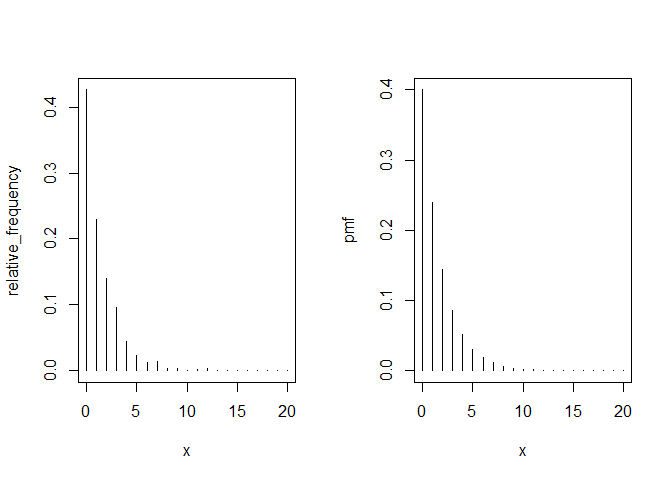<!-- -->

## Negative binomial distribution

$Z$를 독립적이고 동일하게 분포된 $Bernoulli(p)$ 시행에서 $r$번째 성공이
나타나기 전까지의 실패 횟수라고 하자.

그렇다면 $Z$는 음이항 분포를 따르며, $Z \sim nbinomial(r, p)$로
표기한다.

$Y_1, \ldots, Y_r$을 i.i.d. geom$(p)$ 확률 변수라고 하자. 그러면

$$Z = Y_1 + \cdots + Y_r \sim nbinom(r, p).$$

또한, 다음과 같은 성질이 성립한다:

- $E[Z] = \frac{r(1-p)}{p}$

- $Var(Z) = \frac{r(1-p)}{p^2}$

### Negative binomial probability mass function

``` r
par(mfrow=c(2,2))
x <- seq(0,20,1)
sizes = c(2, 3, 10, 10)
probs = c(0.5, 0.5, 0.5, 0.8)

for (i in seq(1,4)){
  y <- dnbinom(x, sizes[i], probs[i])
  plot(x, y, xlim=c(0,20), ylim=c(0,1), xlab="x", ylab="P(X=x)", type="h")
  points(x, y)
  title(paste("neg-binomial(", sizes[i], ",", probs[i], ")"))
}
```

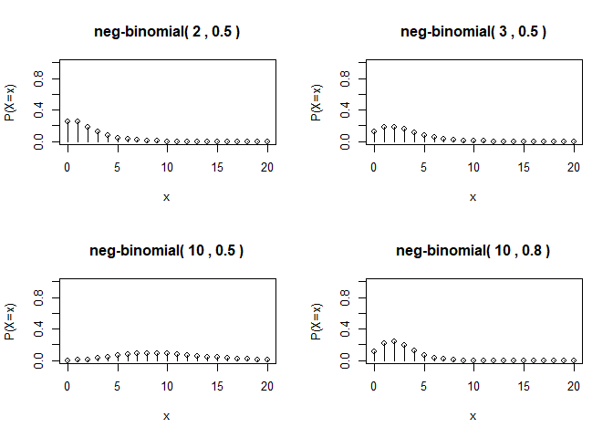<!-- -->

### Negative binomial distribution function

``` r
par(mfrow=c(2,2))
x <- seq(0,20,1)
sizes = c(2, 3, 10, 10)
probs = c(0.5, 0.5, 0.5, 0.8)

for (i in seq(1,4)){
  y<- pnbinom(x, sizes[i], probs[i])
  plot(x, y, xlim=c(0,20), ylim=c(0,1), xlab="x", ylab="P(X<=x)", type="s")
  title(paste("neg-binomial(", sizes[i], ",", probs[i], ")"))
}
```

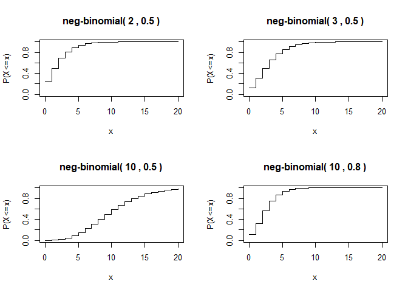<!-- -->

### Comparison with simulation based on Bernoulli trial

음이항 분포의 정의에 따라 음이항 확률변수를 생성해 보자.

다음 코드는 $r = 3$번째 성공이 나타날 때까지의 실패 횟수를 세며, 각
베르누이 시행의 성공 확률 $p=0.4$이다.

``` r
# Repeatedly run this code.
r <- 3; p <- 0.4;

total_failure <- total_success <- 0
while(TRUE){
  if(rbinom(1, 1, p) == 1) total_success <- total_success + 1
  else total_failure <- total_failure + 1
  if (total_success == r) break
}
total_failure
```

    ## [1] 6

음이항 분포를 따르는 확률변수를 다수, `N = 500`, 생성해 보자.

``` r
N <- 500; r <- 3; p <- 0.4; xmax <- 20;

nbinom_rv <- numeric(N)    # preallocation
for (i in 1:N){
  total_trial <- total_success <- 0
  while(TRUE){
    total_success <- total_success + rbinom(1, 1, p)
    total_trial <- total_trial + 1
    if (total_success == r) break
  }
  nbinom_rv[i] <- total_trial - total_success
}

x <- 0:xmax;   pmf <- dnbinom(x, r, p)
relative_frequency <- as.numeric(table(factor(nbinom_rv, levels=x))/N)

par(mfrow=c(1,2))
plot(x, relative_frequency, 'h'); plot(x, pmf, 'h')
```

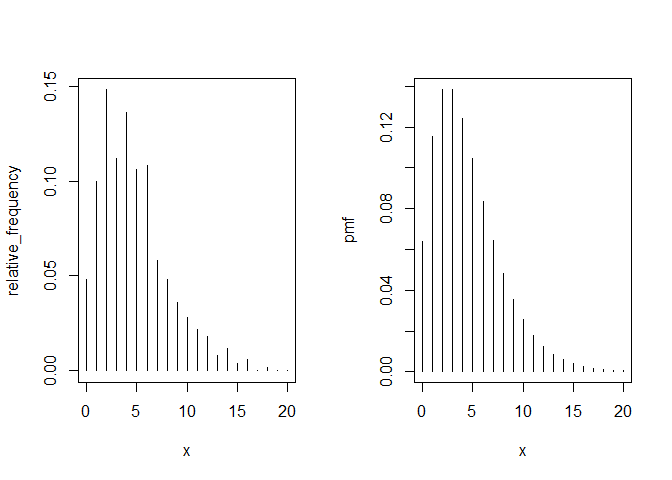<!-- -->

### Example: quality control

어느 제조업체는 각 배치에서 무작위로 100개의 제품을 선택하여 생산 품질을
검사한다.

불량품이 2개를 초과하면 생산을 중단한다.

- 불량 확률 : $p$

100개의 제품을 검사했을 때 (3개 이상의 불량품이 발견되어) 생산이 중단될
확률을 계산해 보자.

$Z$를 세 번째 불량품을 찾기 직전까지 검사한 양품의 수라고 하자.

그러면 $Z \sim nbinomial(3, p)$이며

- $P($생산 중단$) = P(Z+3 \leq 100) = P(Z \leq 97)$

``` r
pnbinom(97, size = 3, prob = 0.01)
```

    ## [1] 0.0793732

이 값은 다음과 같이 이항 분포로도 표현될 수 있다.

- 100개의 제품 중 3개 이상의 불량품이 있을 확률.

``` r
1 - pbinom(2, size = 100, prob = 0.01)
```

    ## [1] 0.0793732

만약 $Z$가 $nbinomial(r, p)$를 따른다면,
$P(Z \leq z) = 1 - P(X \leq r - 1)$이 성립하며, 여기서 $X$는
$binom(z + r, p)$를 따른다.

적당한 $r$과 $p$로 두 값이 같은지 체크해 보자.

``` r
r <- 5; p <- 0.3
pnbinom(3, size = r, prob = p)
```

    ## [1] 0.05796765

``` r
1 - pbinom(r - 1, size = 3 + r, prob = p)
```

    ## [1] 0.05796765

## Poisson distribution

포아송 분포는 시간이나 공간에서 무작위로 발생하는 사건을 모델링하는 데
사용된다.

- 1년 동안의 사고 수
- 한 페이지에서의 오탈자 수
- 1초 동안 방출되는 감마 입자 수
- 1시간 동안 걸려오는 전화 수
- 1년 동안 파산하는 회사 수

$X$가 매개변수 $\lambda$를 가지는 포아송 분포를 따른다고 하고, 이를
$X \sim \text{pois}(\lambda)$로 표기한다.

- $E[X] = \lambda$
- $Var(X) = \lambda$

$\lambda$가 클 수록 더 사건이 빈번히 발생한다는 의미

### Poisson distribution in R

포아송 분포의 확률 질량 함수(PMF), $P(X=x)$, 는 `dpois` 함수를 이용한다.

- `x`는 벡터일 수 있다.

- `lambda` : (음이 아닌) 평균, 벡터일 수 있다.

``` r
dpois(x, lambda, log = FALSE)
```

누적확률분포함수, $P(X \leq q)$:

``` r
ppois(q, lambda, lower.tail = TRUE, log.p = FALSE)
```

Quantile function:

``` r
qpois(p, lambda, lower.tail = TRUE, log.p = FALSE)
```

포아송 분포를 따르는 확률변수 생성기:

``` r
rpois(n, lambda)
```

### Poisson probability mass function

``` r
par(mfrow=c(2, 2))
x <- seq(0, 20, 1)
lambdas = c(0.1, 1, 5, 10)

for (lambda in lambdas){
  y <- dpois(x, lambda)
  plot(x,y,xlim=c(0,20), ylim=c(0,1), xlab="x", ylab="P(X=x)", type="h")
  points(x, y)
  title(paste("Poisson(", lambda, ")"))
}
```

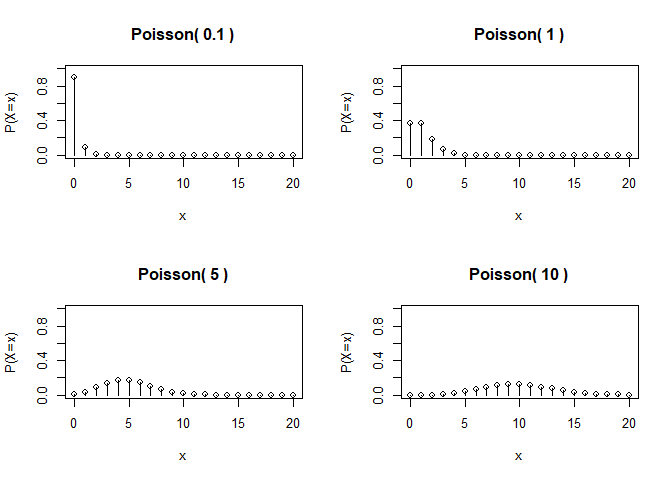<!-- -->

### Poisson probability distribution function

``` r
par(mfrow=c(2, 2))
x <- seq(0, 20, 1)
lambdas = c(0.1, 1, 5, 10)

for (lambda in lambdas){
  y <- ppois(x, lambda)
  plot(x,y,xlim=c(0,20), ylim=c(0,1), xlab="x", ylab="P(X<=x)", type="s")
  title(paste("Poisson(", lambda, ")"))
}
```

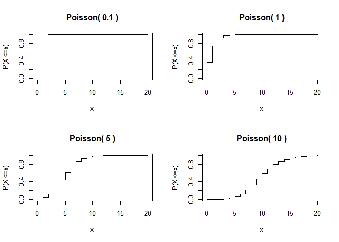<!-- -->

### Comparison with simulation

``` r
N <- 500; lambda <- 10; xmax <- 20

x <- 0:xmax
pmf <- dpois(x, lambda)

frequency <- table(factor(rpois(N, lambda), levels=x))
relative_frequency <- as.numeric(frequency/N)

par(mfrow=c(1,2))
plot(x, relative_frequency, ylab = "relative frequency", 'h')
plot(x, pmf, 'h')
```

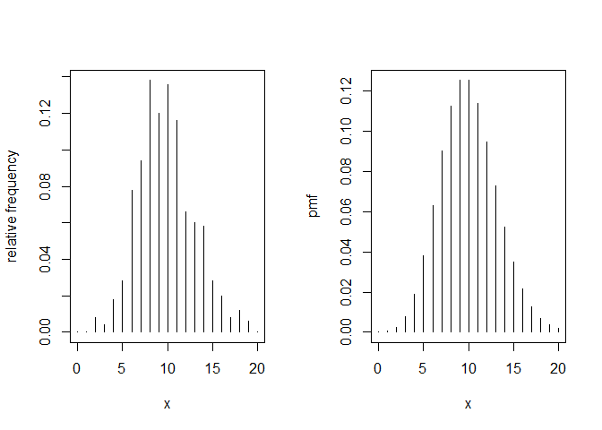<!-- -->

### Poisson approximation to binomial

$n$이 크고 $p$가 작을 때, $binom(n, p)$는 $\mathrm{pois}(np)$로
근사된다.

``` r
n <- 200; p <- 0.03; x <- 0:20
par(mfrow=c(1,2))
plot(x, dbinom(x, n, p), 'h')  # 이항 분포
plot(x, dpois(x, n*p), 'h')    # 포아송 분포
```

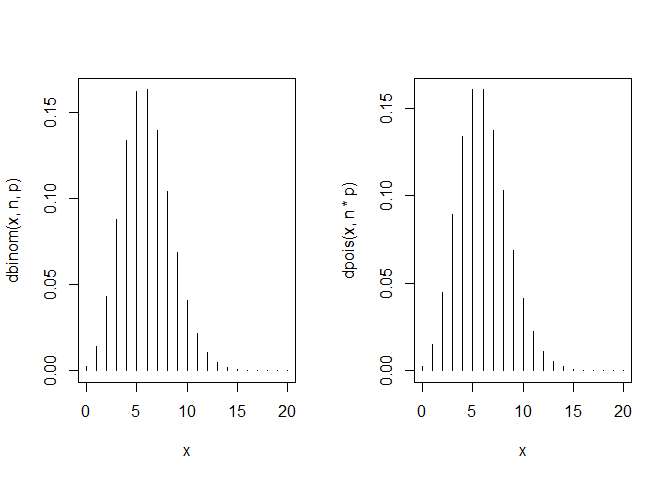<!-- -->
