Continuous random variable
================

## Some of continuous random variables in R

R에서 제공하는 연속 분포와 그 매개변수 입력 이름은 다음과 같다.

| 분포                      | R 이름 (`dist`) | 매개변수 이름    |
|:--------------------------|:----------------|:-----------------|
| 균등(Uniform) 분포        | `unif`          | `min=0, max=1`   |
| 지수(Exponential) 분포    | `exp`           | `rate=1`         |
| 카이제곱(chi-square) 분포 | `chisq`         | `df`             |
| 감마(Gamma) 분포          | `gamma`         | `shape, rate=1`  |
| 정규(Normal) 분포         | `norm`          | `mean=0, sd=1`   |
| t 분포                    | `t`             | `df`             |
| 와이블(Weibull) 분포      | `weibull`       | `shape, scale=1` |

## Uniform distribution

$X$가 $[a,b]$의 주어진 부분 구간에 속할 확률이 그 위치에 상관없이 부분
구간의 길이에만 의존한다면,

$X$는 $[a,b]$에서 균등 분포를 따른다고 한다.

$X \sim U[a,b]$로 표기한다.

확률 밀도 함수(pdf), 평균, 분산은 다음과 같다:

- $f(x) = \frac{1}{b-a}$, 단 $a \leq x \leq b$

- $E[X] = \frac{a+b}{2}$

- $Var(X) = \frac{(b-a)^2}{12}$


### Uniform distribution in R

균등분포의 확률밀도함수, from `min` to `max`.

``` r
dunif(x, min=0, max=1, log = FALSE)
```

균등분포의 확률분포함수

``` r
punif(q, min=0, max=1, lower.tail = TRUE, log.p = FALSE)
```

Quantile function:

``` r
qunif(p, min=0, max=1, lower.tail = TRUE, log.p = FALSE)
```

균등 확률 변수 생성:

``` r
runif(n, min=0, max=1)
```

Example :

``` r
var(runif(100000))  # approximately 1/12
```

    ## [1] 0.08312096

### From uniform random variable to Bernoulli random variable

균등 분포로부터 베르누이 확률 변수를 생성할 수 있다.

``` r
rBernoulli <- function(p = 0.5){
  if(runif(1) < p ) 1
  else 0
}
rBernoulli()
```

    ## [1] 0

아니면 더 간단하게,

``` r
rBernoulli <- function(p = 0.5) as.integer(runif(1) < p) # TRUE -> 1, FALSE -> 0
rBernoulli()
```

    ## [1] 1

여러 개의 샘플을 생성할 수 있다.

``` r
# generate multiple samples
rBernoulli <- function(n, p = 0.5) as.integer(runif(n) < p)
rBernoulli(n = 100, p = 0.9)
```

    ##   [1] 0 1 1 0 1 0 1 1 1 1 1 1 1 1 1 1 1 1 1 1 1 1 1 1 1 1 1 1 1 1 1 1 1 0 1 1 1
    ##  [38] 1 1 1 1 1 1 1 1 1 1 1 0 1 1 1 1 0 1 1 1 1 1 1 1 1 1 1 1 1 1 1 1 1 1 1 1 0
    ##  [75] 1 1 0 1 1 1 1 1 1 1 1 1 1 1 1 1 1 1 1 1 1 0 0 1 1 1

최종적으로 다음과 같은 이항 확률 변수 생성기를 작성할 수 있다.

``` r
my_rbinom <- function(n, size, prob){
  sapply(1:n, function(x) sum(rBernoulli(size, prob)))  # x is a dummy variable
}
```

``` r
my_rbinom(10, 5, 0.6)
```

    ##  [1] 4 2 1 4 2 1 5 4 3 2

``` r
N <- 1000; n <- 20; p <- 0.4

frequency <- table(factor(my_rbinom(N, n, p), levels = 0:n))
relative_frequency <- as.numeric(frequency/N)

x <- 0:n; pmf <- dbinom(x, n, p)

par(mfrow=c(1,2))
plot(x, relative_frequency, 'h')
plot(x, pmf, 'h')
```

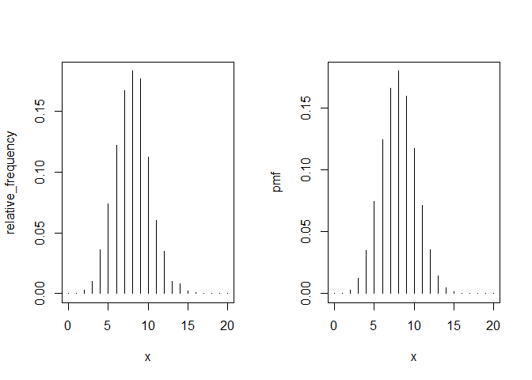<!-- -->

### Two dimensional uniform random variable

독립인 두 균등 확률 변수:

``` r
n <- 10000
X <- runif(n, -1, 1)
Y <- runif(n, -1, 1)
plot(X,Y, cex=0.1) # check scatter plot
```

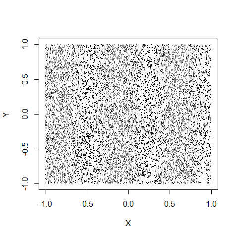<!-- -->

### Uncorrelated but dependent variables

두 변수가 독립적이면 상관관계가 없다는 것을 의미하지만, 상관관계가
없다고 해서 반드시 독립적이라는 것을 의미하지는 않는다.

다음의 예제를 살펴보자.

$Y$의 크기는 $X$의 크기와 동일하여 두 변수는 종속이지만, 부호를 랜덤하게
설정하여 상관관계를 없도록 만들었다.

``` r
n <- 50000
X <- runif(n, -1, 1)
Z <- runif(n, -1, 1)
Y <- sign(Z)*abs(X)
cor(X,Y)   # correlation coefficient is almost 0
```

    ## [1] -0.001310277

``` r
plot(X,Y, cex=0.1) # check scatter plot
```

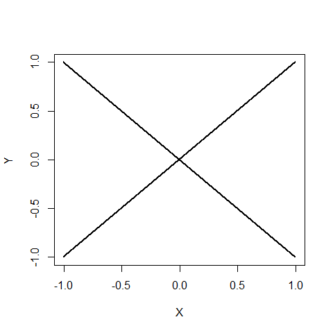<!-- -->

## Normal distribution

### Normal distribution in R

Normal density function

``` r
dnorm(x, mean = 0, sd = 1, log = FALSE)
```

Normal distribution function

``` r
pnorm(q, mean = 0, sd = 1, lower.tail = TRUE, log.p = FALSE)
```

Example :

``` r
pnorm(1.96, lower.tail=TRUE)
```

    ## [1] 0.9750021

``` r
pnorm(1.96, lower.tail=FALSE)
```

    ## [1] 0.0249979

Quantile function

``` r
qnorm(p, mean = 0, sd = 1, lower.tail = TRUE, log.p = FALSE)
```

Example:

``` r
qnorm(0.975, 0, 1)
```

    ## [1] 1.959964

Normal random variables

``` r
rnorm(n, mean = 0, sd = 1)
```

### Normal density with different mean

``` r
x <- seq(-3, 5, 0.01)
plot(x, dnorm(x, 0, 1), type="l", xlab="x", ylab="y",  xlim=c(-3,5))
lines(x, dnorm(x, 1, 1), col="red")
lines(x, dnorm(x, 2, 1), col="blue")
title("Normal distribution: sigma=1, mu=0,1,2")
```

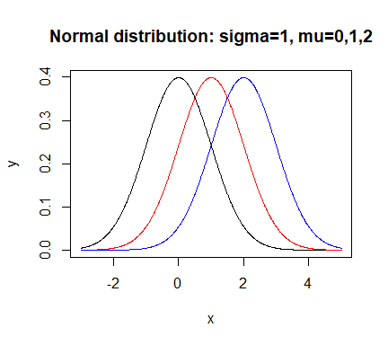<!-- -->

### Normal density with different sigma

``` r
x <- seq(-10, 10, 0.01)
plot(x, dnorm(x, 0, 1), type="l", xlab="x", ylab="y",  xlim=c(-10,10))
lines(x, dnorm(x, 0, 2), col="red")
lines(x, dnorm(x, 0, 3), col="blue")
title("Normal distribution: mu=0, sigma=1,2,3")
```

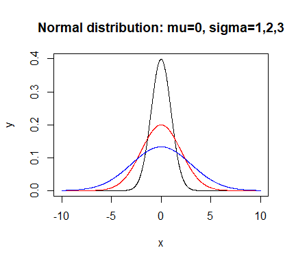<!-- -->

### Comparison between histogram and pdf

``` r
z<-rnorm(10000)
par(las=1)
hist(z, breaks = seq(-5.5, 5.5, 0.2), freq = FALSE)
phi <- function(x) exp(-x^2/2)/sqrt(2*pi)
x <- seq(-5,5,0.1)
lines(x, phi(x))  # or lines(x, dnorm(x))
```

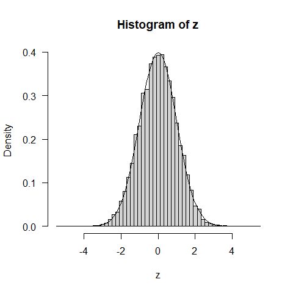<!-- -->

### Sum of independent normal

$X$ ~ $N(\mu_1, \sigma_1^2)$, $Y$ ~ $N(\mu_2, \sigma_2^2)$

그러면, $X+Y$ ~ $N(\mu_1 + \mu_2, \sigma_1^2 + \sigma_2^2)$

``` r
mu1 <-1; mu2 <-1
sigma1 <- 1; sigma2 <- 2
X <- rnorm(50000, mu1, sigma1)
Y <- rnorm(50000, mu2, sigma2)

hist(X + Y, breaks=seq(-10,14,.2), freq=FALSE)

x <- seq(-10, 14, 0.1)
lines(x, dnorm(x, mu1 + mu2, sqrt(sigma1^2 + sigma2^2)))
```

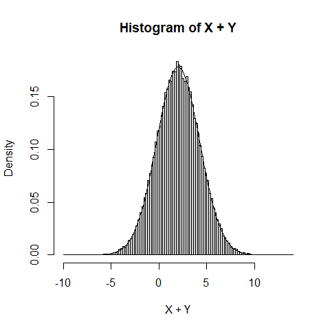<!-- -->

### Correlated normal r.v.s

다음 코드는 상관관계를 가지는 두 정규 확률 변수를 생성하는 방법이다.

``` r
Z1 <- rnorm(1000)
Z2 <- rnorm(1000)

par(mfrow=c(1,3))
rhos <- c(-0.7,0,0.7)
for (rho in rhos){
  X <- Z1
  Y <- rho * Z1 + sqrt(1 - rho^2) * Z2
  plot(X,Y, cex=0.2)
  title(paste("rho = ", rho))
}
```

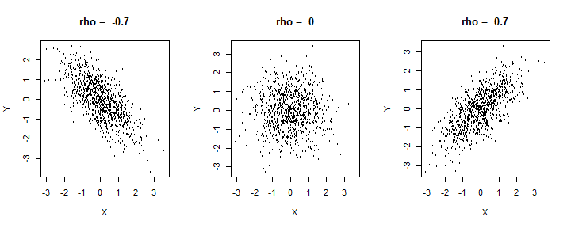<!-- -->

``` r
for (rho in rhos){
  X <- Z1
  Y <- rho * Z1 + sqrt(1 - rho^2) * Z2
  cat("When rho is ", rho, " the variance of X+Y is :",  var(X+Y), "\n")
}
```

    ## When rho is  -0.7  the variance of X+Y is : 0.6687024 
    ## When rho is  0  the variance of X+Y is : 2.207722 
    ## When rho is  0.7  the variance of X+Y is : 3.673663

### Sample mean and sample variance

정규 분포에서 추출된 표본 평균과 표본 분산은 서로 독립이다.

아래 예제에서 시뮬레이션을 통해 확인해 보자.

단, 일반적으로, 두 확률 변수 사이의 독립성을 체크하는 것은 어렵기 때문에
이 예제에서는 대신 두 확률 변수 사이의 상관관계를 계산한다.

``` r
sample_size <- 100  # sample size for each statistic
N <- 10000   # number of simulation

mu <- 3; sigma <- 2

X_bar <- S2 <- numeric(N)  #preallocation

for(i in 1:N){
  rns <- rnorm(sample_size, mu, sigma)    # random normal sample
  X_bar[i] <- mean(rns)
  S2[i] <- var(rns)
}

cat("The correlation between X_bar and S^2 is", cor(X_bar, S2), "\n")
```

    ## The correlation between X_bar and S^2 is 0.006832215

## t distribution

t분포는 통계학에서 주로 작은 표본 크기를 다룰 때 사용되는 확률 분포이다.

정규 분포와 유사하지만, 꼬리가 두꺼운 형태를 가진다.

t분포는 자유도, `df`, 라는 파라미터에 의해 정의된다. 자유도가 커질수록
t분포는 정규 분포에 가까워진다.

### t density

`dt` 함수는 t분포의 확률밀도함수를 표현하며, `df`는 자유도를 결정한다.

``` r
curve(dt(x, df=1), from=-6, to=6, ylab="density", ylim=c(0,0.4))
curve(dt(x, df=2), add = TRUE)
curve(dt(x, df=4), add = TRUE)
curve(dt(x, df=10), add = TRUE)
curve(dnorm(x), lwd=2, add= TRUE)
title("t densities with 1,2,4 and 10 d.f., and normal limit in bold")
```

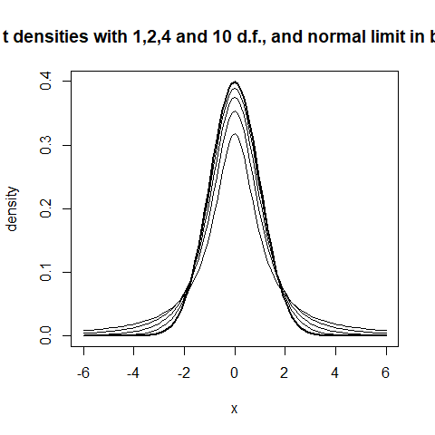<!-- -->

### t statistic

아래 코드에서 실용적인 벡터화 프로그래밍을 위해 `sapply`를 의도적으로
사용했다.

이 코드는 `for` 루프를 사용하는 프로그램으로 다시 작성할 수 있다.

``` r
mu <- 5
sigma <- 3
n <- 7     # sample size for each simulation
N <- 10000   # simulation number
t_statistic <- numeric(N)


# t_statistic is a vector of length N
t_statistic <- sapply(1:N, function(i) { # i is dummy variable
  rsample <- rnorm(n, mu, sigma)
  (mean(rsample) - mu)/(sd(rsample)/sqrt(n)) 
})


hist(t_statistic, breaks = seq(min(t_statistic),max(t_statistic)+0.2,0.2), 
     probability=TRUE)

x <- seq(-6,6,0.01)
lines(x, dt(x, n-1))
```

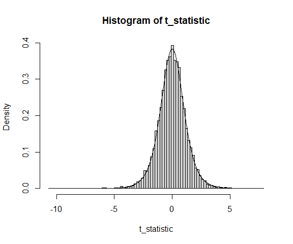<!-- -->

QQ plot

``` r
qqnorm(t_statistic)
```

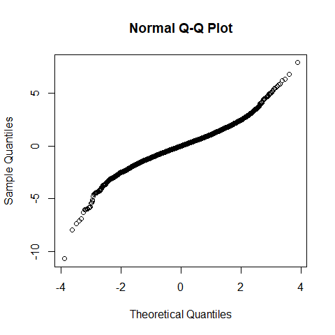<!-- -->

## Chi-square distribution

카이제곱 분포는 주로 독립적인 표준 정규 분포를 따르는 확률 변수들의
제곱합으로 정의된다.

수식으로 표현하자면, 자유도 $k$를 가진 카이제곱 분포는 다음과 같이
정의된다.

\$ Z_1, Z_2, , Z_k \$가 서로 독립적인 표준 정규 분포를 따르는 확률
변수라고 하자.

카이제곱 분포의 확률 변수 $X$는 다음과 같이 정의한다.

$$ X = \sum_{i=1}^{k} Z_i^2 $$

이때 $X$는 자유도 $k$를 가지는 카이제곱 분포를 따른다고 하며,
$X \sim \chi^2(k)$로 표기한다.

### Chi-square density

`dchisq` 함수를 이용한다.

``` r
curve(dchisq(x, df=1), from=0, to=8, ylab="density", ylim=c(0,0.5))
curve(dchisq(x, df=2), col="red", add = TRUE)
curve(dchisq(x, df=3), col="blue", add = TRUE)
curve(dchisq(x, df=4), col="darkgreen", add = TRUE)
legend("topright", c("df=1", "df=2", "df=3", "df=4"),  pch="----", col=c("black","red","blue","darkgreen"))
```

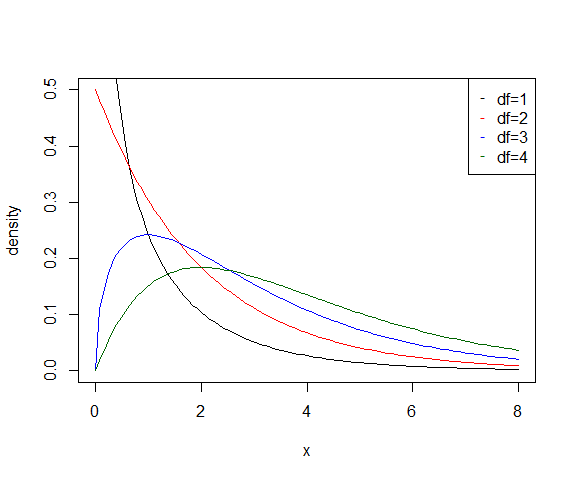<!-- -->

### Chi-square simulation

카이제곱 분포의 정의에 따라 정규확률변수의 제곱을 이용하여 생성해 보자.

- 물론 카이제곱 확률 변수는 `rchisq` 함수를 통해 생성할 수 있다.

- 아래의 코드를 이해했으면 `rchisq` 함수를 이용해서 같은 작업을 하는
  코드를 작성해 보자.

``` r
dfs <- c(1,2,3,4)
N <- 5000

par(mfrow=c(2,2))

for (df in dfs){
  
  chi_rv <- numeric(N)
  
  for (i in 1:df) chi_rv <- chi_rv + rnorm(N)^2
  
  hist(chi_rv, breaks=seq(0, 30, 0.5), freq=FALSE, main=paste("d.f. = ", df))
  
  curve(dchisq(x, df), add=TRUE)
}
```

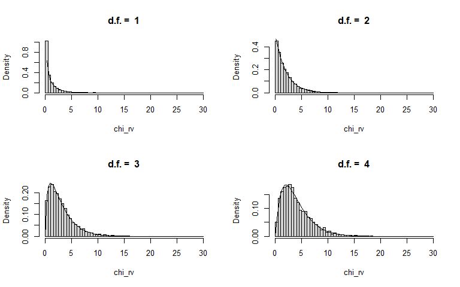<!-- -->

### Sample mean and sample variance from chi-square

모집단 분포가 카이제곱 분포일 경우, 아래에서 보여주는 바와 같이 표본
평균과 표본 분산은 독립적이지 않다.

``` r
sample_size <- 100  # sample size for each statistic
N <- 10000   # number of simulation

dof <- 10

X_bar <- S2 <- numeric(N)  #preallocation

for(i in 1:N){
  
  chi_rv <- rchisq(sample_size, dof)    # 카이제곱분포가 모집단이라면
  
  X_bar[i] <- mean(chi_rv)
  
  S2[i] <- var(chi_rv)
  
}

cat("The correlation between X_bar and S^2 is ", cor(X_bar, S2), "\n")
```

    ## The correlation between X_bar and S^2 is  0.49078

## Cauchy distribution

평균이 존재하지 않는 확률분포로서 대표적으로 Cauchy 분포가 있으며 다음
코드에서 `rcauchy`는 Cauchy 확률 변수를 생성한다.

반복적으로 코드를 실행시키며 표본 평균이 일정하지 않고 계속 크게 변함을
관찰하라.

``` r
# Generate a sample from the Cauchy distribution
sample_size <- 10000
cauchy_sample <- rcauchy(sample_size)

sample_mean <- mean(cauchy_sample)

print(paste("Sample mean:", sample_mean))
```

    ## [1] "Sample mean: 1.03047626361385"

## Life time model : exponential and Weibull

$X \geq 0$는 확률변수로 어떤 사건이 발생할 때까지의 시간이라고 하자.

- 예를 들어, 어떤 기계 부품의 고장 시간이나 부품의 수명.

$f$와 $F$를 각각 $X$의 확률밀도함수와 누적분포함수라고 하자. 그러면 생존
함수는 다음과 같이 정의된다.

$$G(x) = P(X > x) = 1 - F(x).$$

- $G(x)$는 부품이 $x$시간까지 생존할 확률이다.

고장률은 $\lambda(x)$로 표현하고 hazard function이라고 한다.

- Hazard function의 값이 크면 그만큼 고장이 발생할 확률이 높다고
  해석한다.

$$\lambda(x) dx = \mathbb{P}(\text{부품이 }x\text{와 }x+dx\text{ 사이에서 고장날 확률 } |\,x\text{에서 여전히 작동 중인 경우}) = \frac{f(x)dx}{G(x)} $$

양변에 $dx$를 제거하면 다음과 같다.

$$\lambda(x) = \frac{f(x)}{G(x)}$$

$\lambda$로부터 밀도 함수 $f$를 다음의 과정을 통해 구할 수 있다.

먼저, $f(x)$는 $F(x)$의 미분이고, $G(x) = 1 - F(x)$이므로,

$$f(x) = \frac{d F(x)}{dx} = \frac{d}{dx} (1 - G(x)) = - \frac{dG(x)}{dx} = - G'(x).$$

이것을 이용하여여

$$\lambda(x) = \frac{f(x)}{G(x)} = -\frac{G'(x)}{G(x)} = - \frac{d}{dx} \log G(x)$$

를 얻는다. (마지막 등식은 chain rule을 이용하여 확인해 보라.)

따라서,

$$G(x) = \exp\left(- \int_0^x \lambda(u) du \right)$$

이다. (위 $G(x)$ 식을 $x$로 미분하여 $-$를 적용하면 $\lambda(x)$임을
확인하라.)

그러므로,

$$f(x) = \lambda(x) \exp \left( - \int_0^x \lambda(u) d u \right).$$

## Exponential distribution

만약 $\lambda(x) = \lambda$로 고장률이 일정하다면, $X$는 지수 분포를
가진다고 하고, $X \sim \text{Exp}(\lambda)$로 표기한다.

- $f(x) = \lambda \exp(-\lambda x)$

- $F(x) = 1 - \exp(-\lambda x)$

- $\mu = 1/\lambda$

- $\sigma = 1/\lambda$

Memoryless property

- 노화가 고장률에 영향을 미치지 않는다, 즉, 부품은 무작위로 고장난다.

- $P(X > s + t \mid X > s) = \frac{P(X > s + t)}{P(X > s)} = P(X > t)$

- 나이 $s$까지 생존했다고 가정할 때, 추가 시간 $t$를 더 생존할 확률은 막
  태어났을 때 $t$만큼 생존할 확률과 동일하다.

### Exponential distribution in R

Density function with $\lambda =$ `rate`:

``` r
dexp(x, rate = 1, log = FALSE)
```

Distribution function with $\lambda =$ `rate`:

``` r
pexp(q, rate = 1, lower.tail = TRUE, log.p = FALSE)
```

Quantile function with $\lambda =$ `rate`:

``` r
qexp(p, rate = 1, lower.tail = TRUE, log.p = FALSE)
```

Random variables with $\lambda =$ `rate`:

``` r
rexp(n, rate = 1)
```

### Exponential density

``` r
x = seq(0,8,0.01)
plot(x, dexp(x, rate=2), type="l", ylab="f(x)", col=1)
lines(x, dexp(x, rate=1) , col=2)
lines(x, dexp(x, rate=0.5), col=3)
legend("topright", c("lambda = 2", "lambda = 1", "lambda = 0.5"), col=c(1,2,3), lty = c(1,1,1))
```

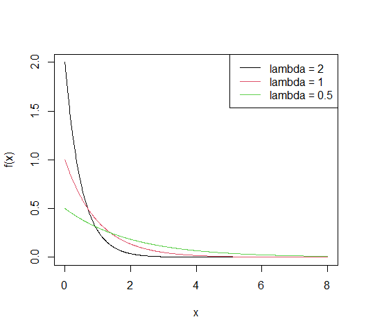<!-- -->

### Exponential distribution

``` r
x = seq(0,8,0.01)
plot(x, pexp(x, rate=2), type="l", ylab="f(x)", col=1)
lines(x, pexp(x, rate=1) , col=2)
lines(x, pexp(x, rate=0.5), col=3)
legend("bottomright", c("lambda = 2", "lambda = 1", "lambda = 0.5"), col=c(1,2,3), lty = c(1,1,1))
```

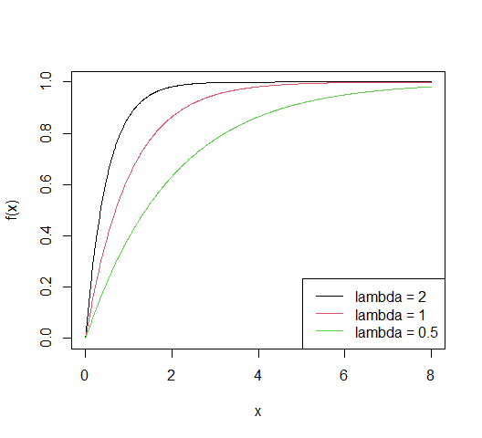<!-- -->

### Exponential and Chi-square

$\lambda = 0.5$인 지수 분포를 따르는 확률 변수와 자유도 $=2$인 카이제곱
분포를 따르는 확률 변수는 동일한 분포를 가진다.

``` r
X <- rexp(100000, rate = 0.5)
Y <- rchisq(100000, df = 2)

par(mfrow = c(1,2))
hist(X, freq=FALSE, breaks=20, main="Exponential, lambda=0.5")
hist(Y, freq=FALSE, breaks=20, main="Chi-square, df=2")
```

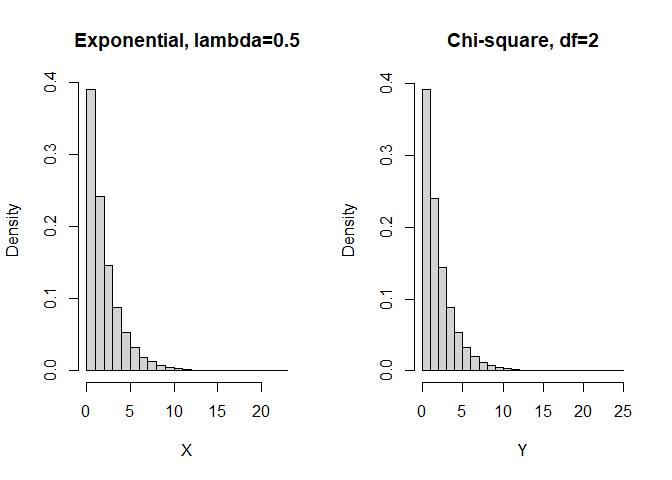<!-- -->

### Example : radioactive decay

우라늄-238은 연간 $\lambda$의 비율로 토륨-234로 붕괴된다.

우라늄-238의 반감기는 $4.47 \times 10^9$년이며, 이를 이용해 $\lambda$를
구해보자.

(반감기는 일정량의 우라늄-238이 절반으로 붕괴되어 토륨-234가 되는 데
걸리는 시간이다.)

단일 원자의 붕괴 시간은 확률 변수로 $X$라고 하자.

그러면 $X \sim \text{exp}(\lambda)$이고,

- $\mathbb P(X > 4.47 \times 10^9) = 0.5$

- $\mathbb P(X > x) = \exp(-\lambda x)$이므로, 우리는 다음과 같은 관계를
  가진다.

``` r
(lambda <- log(2)/(4.47*10^9))
```

    ## [1] 1.550665e-10

### Memoryless property

지수 분포는 Memoryless property을 가진다.

$X$가 지수 분포를 따른다고 하자.

다음은 $\mathbb P(X > 4)$를 시뮬레이션으로 추정한 것이다.

``` r
n <- 1000000
y <- rexp(n, rate = 0.1)
larger_4 <- y[y > 4]
(ratio1 <- length(larger_4)/n)
```

    ## [1] 0.671143

다음은 $\mathbb{P}(X > 12 \mid X > 8)$을 시뮬레이션한 것으로, 이전
결과와 유사하다.

``` r
larger_8 <- y[y > 8]
larger_12 <- y[y > 12]

(ratio2 <- length(larger_12)/length(larger_8))
```

    ## [1] 0.6716166

### Inversion method : Generate exponential from uniform

기본이 되는 균등 분포로부터 다른 분포를 따르는 확률변수를 생성할 수
있다.

그 중 하나는 inversion 방법으로, 분포함수의 역함수(quantile function)에
균등 분포를 적용하는 방법이다.

1.  $U \sim \text{Uniform}(0, 1)$인 균등 분포를 따르는 확률 변수 $U$를
    생성한다.

2.  지수 분포의 누적 분포 함수(CDF)는 $F(x) = 1 - \exp(-\lambda x)$이다.
    여기서 $F(x) = U$로 설정한다.

3.  식을 풀어서 $x$에 대한 값을 구한다:
    $$ U = 1 - \exp(-\lambda x) \implies \exp(-\lambda x) = 1 - U $$
    양변에 로그를 취하면:

    $$-\lambda x = \log(1 - U) \implies x = -\frac{1}{\lambda} \log(1 - U)$$

4.  따라서, $x = -\frac{1}{\lambda} \log(1 - U)$는 $\lambda$ 매개변수를
    가지는 지수 분포를 따르는 확률 변수가 된다.

5.  $U$와 $1-U$의 분포는 동일하므로, $1 - U$ 대신 $U$를 사용하여 동일한
    결과를 얻을 수 있다. 따라서,

$$x = -\frac{1}{\lambda} \log(U)$$

이는 $U \sim \text{Uniform}(0, 1)$에서 얻은 난수로 $\lambda = 1$인 지수
분포를 생성하는 방법이다.

``` r
Nsim <- 10000       #number of random variables
U <- runif(Nsim)
X <- -log(U)        #transforms of uniforms
Y <- rexp(Nsim)     #exponentials from R

par(mfrow=c(1,2))   #plots
hist(X, freq=FALSE, main="Exp from Uniform")
hist(Y, freq=FALSE, main="Exp from R")
```

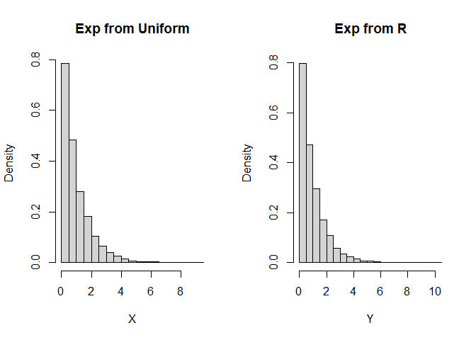<!-- -->

## Weibull distribution

$X$는 매개변수 $\lambda$와 $m$을 가진 와이블(Weibull) 분포를 따른다고
하고, $X \sim \text{Weibull}(\lambda, m)$와 같이 표기한다.

이때 Weibull 분포의 hazard function은 다음과 같다.

$$\lambda(x) = m \lambda x^{m-1}$$

- $\lambda > 0$: 분포의 크기나 범위를 조절하여 분포의 늘어짐 정도를
  결정한다.
- $m > 0$: 분포의 형태를 결정하며, 사건 발생 확률의 시간에 따른 변화를
  나타낸다. $m=1$이면 지수분포이다.

생존 함수 $G(x)$는 $\exp(-\lambda x^m)$이다.

$X$의 확률밀도함수 $f(x)$는 다음과 같다.

$$f(x) = \lambda(x) \exp \left( - \int_0^x \lambda(u) d u \right) = m \lambda x^{m-1} \exp \left( - \int_0^x m \lambda u^{(m-1)} d u \right) = m\lambda x^{m-1}\exp(-\lambda x^m).$$

R에서의 Weibull 분포 매개변수화는 위에서 제시한 것과 조금 다르다.

- `shape` 인수에는 $m$을 사용하고, `scale` 인수에는 $\lambda^{(-1/m)}$을
  사용한다.

아래 코드에서는 $m$의 값에 따라, hazard 함수의 형태를 나타낸다.

``` r
x=seq(0,4,0.001)

## m * lambda x^(m-1))
curve(2*x, from=0, to=4, ylab="hazard function")
lines(x, 2.5*x^(1.5))
lines(x, 0.5*x^(-0.5))
lines(x, 1.5*x^0.5)
lines(x, rep(1,length(x)))

text(2.3, 6.99, "m>2")
text(3, 5.2, "m=2")
text(2.5, 2.65, "1<m<2")
text(3.5, 1.3, "m=1")
text(3, 0.52, "m<1")
```

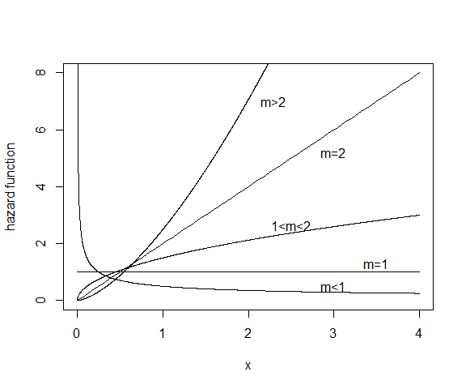<!-- -->

$m$의 값에 따른 pdf 함수의 형태

``` r
par(mfrow=c(3,1))
curve(dweibull(x, shape=0.5, scale=2^(-1/0.5)), from=0, to=4, ylab="f(x)", lwd=3)
text(2,2,"Weibull(2,0.5) density")
curve(dweibull(x, shape=1.5, scale=2^(-1/1.5)), from=0, to=4, ylab="f(x)", lwd=3)
text(2,0.6,"Weibull(2,1.5) density")
curve(dweibull(x, shape=3, scale=2^(-1/3)), from=0, to=4, ylab="f(x)", lwd=3)
text(2,0.8,"Weibull(2,3) density")
```

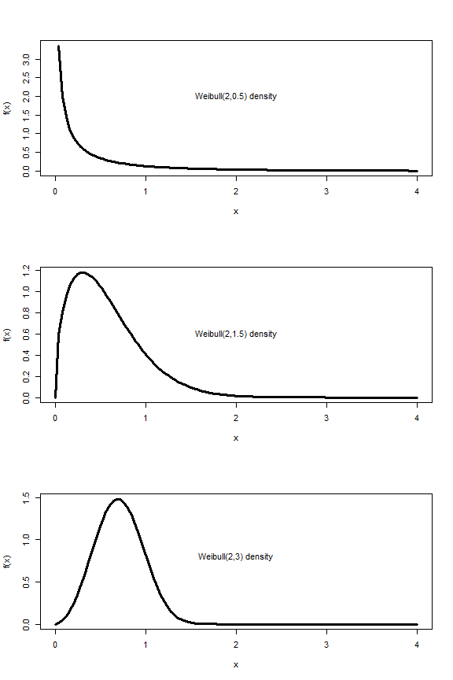<!-- -->

### Example : time to the next disaster

원자력 발전소가 특정 연도에 큰 사고를 겪을 확률은 그 나이에 비례한다고
가정하자.

또한, 큰 사고가 발생할 때까지 매년 원자력 발전소를 하나씩 건설한다고
가정하자.

$T$를 첫 번째 큰 사고가 발생할 때까지의 시간이라고 하자.

단일 발전소가 나이 $t$일 때, 다음 해에 사고가 발생할 확률을
$\alpha t$라고 하자.

- $t$년 후에는 $t$개의 발전소가 운영 중이므로, 다음 해에 어느
  하나에서라도 사고가 발생할 확률은 $\alpha t^2$가 된다.

이를 Weibull 분포의 hazard function과의 관계로 표현하면,

$$m\lambda t^{m-1} = \alpha t^2$$

이므로, $m=3$, $\lambda=\alpha/3$을 의미한다.

따라서, $T \sim \text{Weibull}(\alpha/3, 3)$이다.

예를 들어, $\alpha$가 1/1,000,000이라고 하자.

첫 번째 큰 사고가 향후 50년 내에 발생할 확률, $\mathbb P (X \leq 50)$을
계산해 보자.

``` r
alpha <- 1/1000000
m <- 3
lambda <- alpha/3
pweibull(50, shape = m, scale = lambda^(-1/m))
```

    ## [1] 0.04081054
