More on simulation
================

## Inversion method

### Generate normal distribution from uniform random variables

정규 누적 분포 함수의 역함수를 사용하여 균등 분포에서 정규 분포를 간단히
생성할 수 있다.

- R에서는 `qnorm` 함수를 사용한다.

- 이는 효율적이지 않을 수 있지만 이해하기 쉽다.

``` r
n <- 10000
my_norm_rv <- qnorm(runif(n))  # 정규분포가 된다.

# plot histogram and normal pdf
hist(my_norm_rv, breaks = seq(-5,5,0.2), freq=F)
x <- seq(-5,5,0.1)
lines(x, dnorm(x))
```

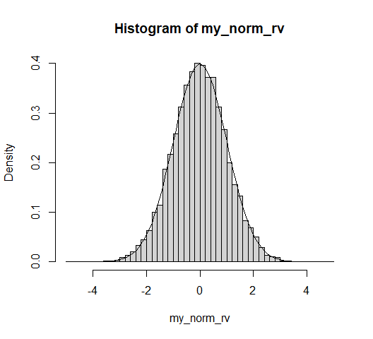<!-- -->

QQ-plot

``` r
qqnorm(my_norm_rv)
```

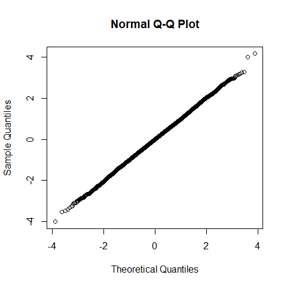<!-- -->

### Exponential distribution from uniform random variables

이전에 한번 살펴본 이 방법을 `lambda = 0.5`로 복습해 보자.

``` r
lambda <- 0.5
Nsim <- 10000       #number of random variables
U <- runif(Nsim)
X <- - 1/lambda *log(U)        #transforms of uniforms
Y <- rexp(Nsim)     #exponential from R
par(mfrow=c(1,2))   #plots
hist(X, freq=FALSE, main="Exp from Uniform")
hist(Y, freq=FALSE, main="Exp from R")
```

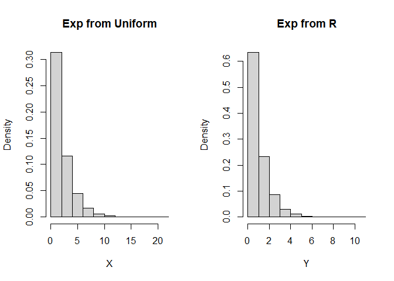<!-- -->

## Box-Muller algorithm to generate normal

Box-Muller 방법은 두 개의 균등 분포에서 두 개의 정규 분포를 생성하는
방법을 제시한다.

- 아래 코드에서 `-2*log(U1)`는 $\lambda=2$인 지수 분포를 따르며, 이는
  자유도가 2인 카이제곱 분포와 같음을 상기하라.

한편, 자유도 2인 카이제곱 분포는 두 독립인 정규확률변수의 제곱들의
합이다. 따라서 다음과 같이 표현 가능하다.

$$ -2 \log (U_1) \sim \chi^2(2) = Z_1^2 + Z_2^2 $$

- 여기서, $Z_1$과 $Z_2$는 서로 독립인 표준정규확률변수이다.

- 피타고라스 정리를 상기하여, $\sqrt{-2 \log (U_1)}$를 빗변의 길이,
  $Z_1$과 $Z_2$를 밑변과 높이로 간주하자.

  - 즉, 어떤 각 $\theta$에 대해,
    $Z_1 = \sqrt{-2 \log (U_1)} \cos \theta$,
    $Z_2 = \sqrt{-2 \log (U_1)} \sin \theta$.

  - 각, $\theta$ 또한 균등분포를 이용하여 $[0, 2\pi]$ 구간에서 랜덤하게
    결정할 것이다.

다음은 R 코드 예제이다:

``` r
Nsim <- 10000
U1 <- runif(Nsim)   #uniform1
U2 <- runif(Nsim)   #uniform2
Z1 <- sqrt(-2*log(U1)) * cos(2*pi*U2)
Z2 <- sqrt(-2*log(U1)) * sin(2*pi*U2)

par(mfrow=c(1,2))
x <- seq(-5,5,0.1)
hist(Z1, breaks = seq(-5,5,0.2), freq=FALSE)
lines(x, dnorm(x), col='red')

hist(Z2, breaks = seq(-5,5,0.2), freq=FALSE)
lines(x, dnorm(x), col='red')
```

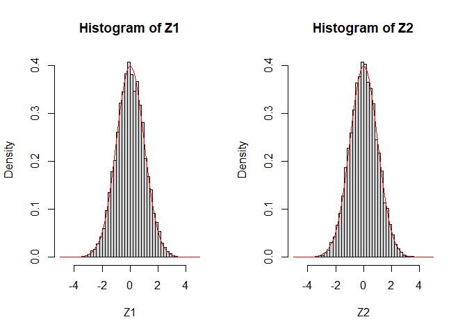<!-- -->

## Rejection method

확률밀도함수 $f$가 $[a, b]$ 구간에서만 0이 아니고, 어떤 양수 $k$에 대해
$f < k$라고 하자.

이 경우에 유용하게 사용할 수 있는 rejection method에 대해 설명한다.

- $X \sim U(a, b)$와 $Y \sim U(0, k)$를 독립적으로 생성하자.

- 만약 $Y < f(X)$이면 $X$를 반환하고(accept), 그렇지 않으면 이전 단계로
  돌아간다(reject).

### Example

확률밀도함수 $f$가 $\sin$ 형태로 생겼다고 가정해 보자.

$$f(x) = 0.5 \sin(x), \quad x \in [0,\pi]$$

``` r
NSim <- 15
X <- runif(NSim, 0, pi)
Y <- runif(NSim, 0, 0.5)
Z <- X[0.5*sin(X) > Y ]  # f > Y 인 경우만 선택

x <- seq(0, pi, 0.001)
f <- 0.5*sin(x)  # pdf

plot(x, f, col='blue', xlab="X", ylab="Y", type='l')

# accept
points(X[0.5*sin(X) > Y ], Y[0.5*sin(X) > Y ], col='black')
points(X[0.5*sin(X) > Y ], rep(0, sum(0.5*sin(X) > Y)), col='black', pch=4)

# reject
points(X[0.5*sin(X) < Y ], Y[0.5*sin(X) < Y ], col='red')


legend("topright", legend = c("f(x)", "Accepted", "Rejected"),
       col = c("blue", "black", "red"), pch = c(NA, 1, 1), lty = c(1, NA, NA))
```

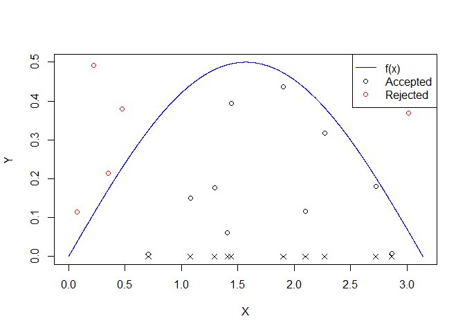<!-- -->

더 많이 생성하여 히스토그램으로 표현해 보자.

``` r
NSim <- 10000
X <- runif(NSim, 0, pi)
Y <- runif(NSim, 0, 0.5)
Z <- X[0.5*sin(X) > Y ]  #f > Y 인 경우만 선택

hist(Z, breaks = 40, freq = FALSE)

x <- seq(0, pi, 0.001)
f <- 0.5*sin(x)
lines(x, f, col='blue')
```

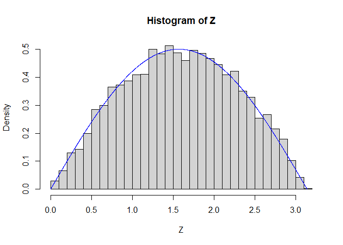<!-- -->

## Random walk

### One-dimensional random walk

정수 상의 랜덤 워크는 0에서 시작하여 각 단계마다 +1 또는 -1로
이동하는데, 이때 두 방향으로 이동할 확률이 동일하다.

``` r
n <- 100              # number of random walk
walk <- rbinom(n, size = 1, prob = 0.5)     # generate Bernoulli random number
walk[walk == 0] <- -1               # change 0 as -1
random_walk <- c(0, cumsum(walk))   # cumulative sum of walk is random walk, starting at zero
plot(random_walk, type='s')
```

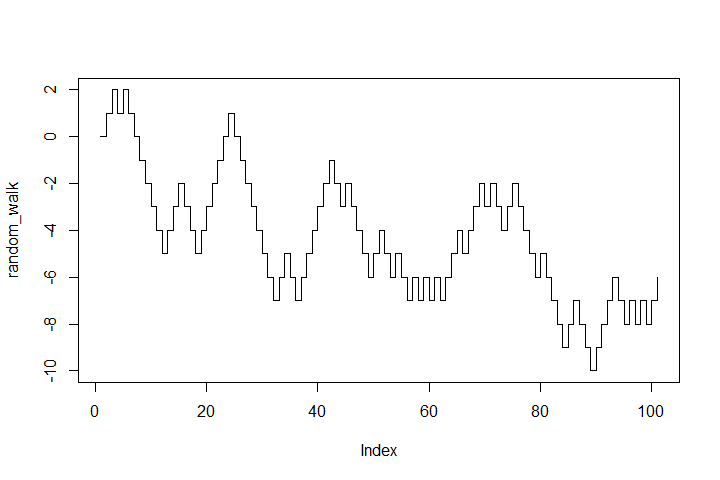<!-- -->

### Random walk with unequal probablity

위 코드에서 `prob`의 수치를 변경

``` r
n <- 100              # number of random walk
walk <- rbinom(n, size = 1, prob = 0.6)     # generate Bernoulli random number
walk[walk == 0] <- -1               # change 0 as -1
random_walk <- c(0, cumsum(walk))   # cumulative sum of walk is random walk, starting at zero
plot(random_walk, type='s')         # upward random walk
```

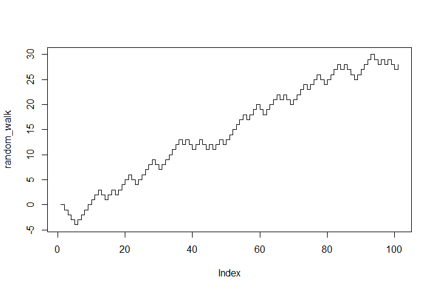<!-- -->

## Brownian motion

위의 예시에서 각 이동이 단순히 +1 또는 -1이었다면,

각 이동이 정규 분포를 따를 경우, 이 과정은 브라운 운동의 근사치가 된다.

``` r
n <- 1000              # number of random walk
walk <- rnorm(n, mean = 0, sd = 1)     # generate normal random number
Brownian_motion <- c(0, cumsum(walk))   # cumulative sum of walk is random walk, starting at zero
plot(Brownian_motion, type='l')
```

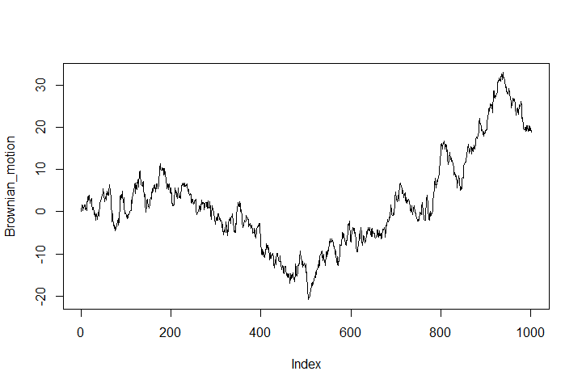<!-- -->

`time_index`의 시간 간격을 더 작게 만들면 더 정확한 근사가 된다.

``` r
time_index <- seq(0,n*0.01,0.01)
plot(time_index, Brownian_motion, type='l')
```

<!-- -->

정규분포의 평균과 표준편차를 조정할 수 있다.

With `sd = 0.01`:

``` r
n <- 1000              # number of random walk
walk <- rnorm(n, mean = 0, sd = 0.01)     # generate normal random number
Brownian_motion <- c(0, cumsum(walk))   # cumulative sum of walk is random walk, starting at zero
plot(Brownian_motion, type='l')
```

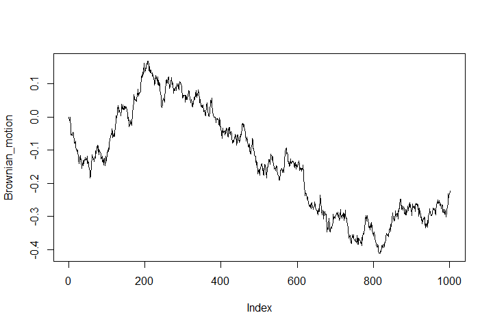<!-- -->

With `mean = 0.1`:

``` r
n <- 1000              # number of random walk
walk <- rnorm(n, mean = 0.1, sd = 1)     # generate normal random number
Brownian_motion <- c(0, cumsum(walk))   # cumulative sum of walk is random walk, starting at zero
plot(Brownian_motion, type='l')
```

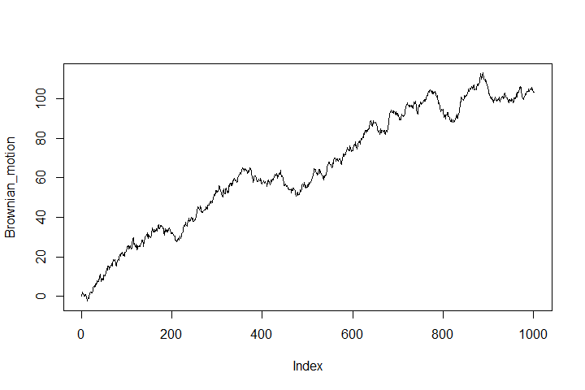<!-- -->

## Geometric Brownian motion

브라운 운동의 지수 버전인 기하 브라운 운동은 금융 자산 가격 모델링에
널리 사용된다.

- 다음은 기하 브라운 운동의 단순화된 버전을 구현한 것이다.

- 주가 움직임이 1에서 시작하는 것으로 간주한다.

``` r
n <- 1000              # number of random walk
walk <- rnorm(n, mean = 0, sd = 0.01)     # generate normal random number
Brownian_motion <- c(0, cumsum(walk))   # cumulative sum of walk is random walk, starting at zero
GBM <- exp(Brownian_motion)
plot(GBM, type='l')
```

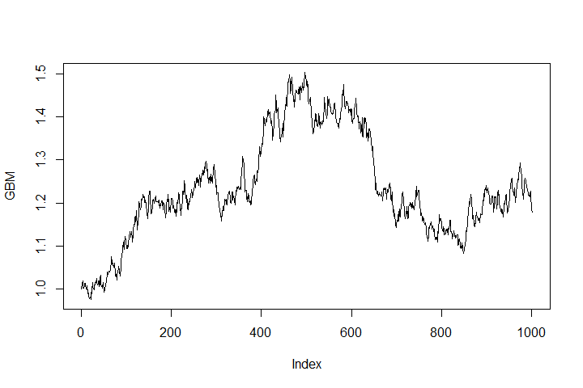<!-- -->

## Poisson process

포아송 과정(Poisson process)은 독립 시행들의 연속 시간 버전이라고 볼수
있다.

단위 시간당 고정된 비율 $\lambda$로 발생하는 사건들을 생각해 보자.
(콜센터에 전화들이 걸려오는 사건들, 상점에 고객이 방문하는 사건들)

- $(s, t)$ 구간에서 기대되는 사건 수는 $\lambda\times(t-s)$이다.

- $(t, t+dt)$ 구간에서 사건이 발생할 무한소(infinitesimal) 확률은
  $\lambda dt$이다.

$T_k$를 $k-1$ 번째와 $k$ 번째 사건 사이의 시간이라고 하자.

$N(s, t)$를 $(s, t)$ 동안 발생한 사건의 수라고 하자.

- 각 사건들 간의 시간인 $T_k$는 i.i.d. $\mathrm{Exp}(\lambda)$의 확률
  변수이다.

- $N(s, t)$는 $\text{Pois}(\lambda(t-s))$를 따른다.

- 만약 $(a, b)$와 $(s, t)$가 겹치지 않는다면, $N(a, b)$와 $N(s, t)$는
  독립이다.

포아송 과정의 예시는 다음과 같다:

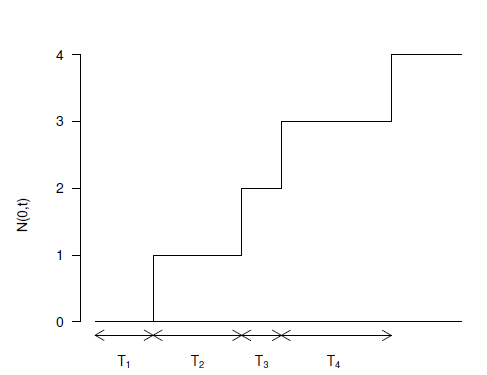

### Example : Poisson process

``` r
lambda <- 0.5; t.end <- 20
t <- N <- 0
i <- 1

while(t[i] < t.end){
  arrival <- rexp(1, lambda)
  i <- i + 1
  t[i] <- t[i-1] + arrival
  N[i] <- N[i-1] + 1
}

plot(t, N, type='s', xlab='time', ylab = 'Poisson Process')
```

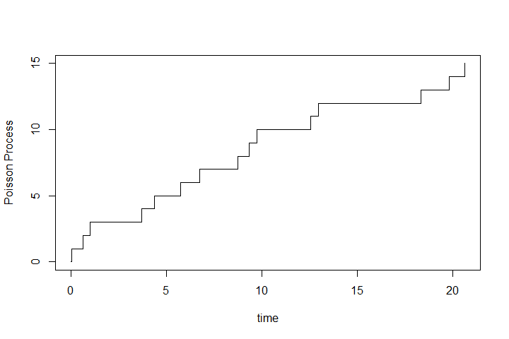<!-- -->

### Merging and Thinning

Merging

- 비율 $\lambda_1$을 가지는 포아송 과정을 비율 $\lambda_2$를 가지는
  독립적인 포아송 과정과 합치면, 결과는 비율 $\lambda_1 + \lambda_2$인
  포아송 과정이 된다.

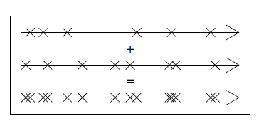

Thinning

각 사건에 대해 (편향된) 동전을 던져 하나의 Poisson 과정을 thinning할 수
있다.

- 앞면이 나오면 사건을 유지한다.

- 뒷면이 나오면 사건을 버린다.

비율 $\lambda$인 포아송 과정에서 시작하여, 사건을 유지할 확률이 $p$라면,

결과는 비율 $p\lambda$인 포아송 과정이 된다.

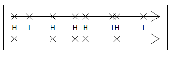

### Example : Thinging

``` r
lambda <- 0.5; t.end <- 20
timeline <- N <- 0
i <- 1
p <- 0.4

while(timeline[i] < t.end){
  arrival <- rexp(1, lambda)
  i <- i + 1
  timeline[i] <- timeline[i-1] + arrival
  N[i] <- N[i-1] + 1
}

TF <- runif(length(N) - 1) < p  # coin toss
t1 <- timeline[c(TRUE, TF)]
t2 <- timeline[c(TRUE, !TF)]

N1 <- 0:(length(t1)-1)
N2 <- 0:(length(t2)-1)

plot(timeline, N, type='s', xlim = c(0, max(timeline)), 
     ylim = c(0, max(N)), xlab='time', ylab = '# of events')
lines(t1, N1, type='s', col = 'blue', lty='dashed')
title(main="Simulation of Thinned Poisson Process")


points(t1[2:length(t1)], rep(0, length(t1)-1), pch=4, col='blue')
points(t2[2:length(t2)], rep(0, length(t2)-1), pch=4, col='red')


legend("topleft", legend=c("Original Process", "Thinned Process"),
       col=c("black", "blue"), lty=c("solid", "dashed"), bty="n")
```

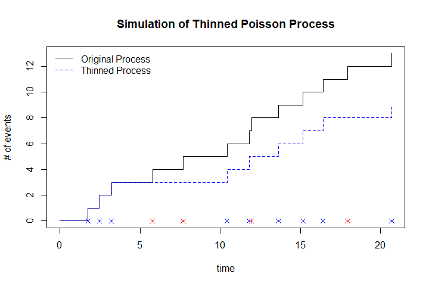<!-- -->

### Queuing simulation

고객 도착 시간과 서비스에 소요되는 시간이 각각 지수 분포를 따른다고
가정하자.

- $(t, t + dt)$ 동안 새로운 고객이 도착할 확률은 $\lambda dt$이다.

- $(t, t + dt)$ 동안 서비스가 완료될 확률은 $\mu dt$이다.

- 다음 코드에서는 구간 $(t, t + dt)$에서 도착과 출발이 동시에 발생하지
  않는다고 가정한다.

  - 그 확률이 매우 작기 때문.

``` r
lambda <- 1     # arrival rate
mu <- 1.1       # service rate
t.end <- 100    # duration of simulation
t.step <- 0.05  # time step
queue <- rep(0, t.end/t.step + 1)

for (i in 2:length(queue)) {
  if (runif(1) < lambda*t.step) { # arrival
    
    queue[i] <- queue[i-1] + 1
    
  } else if (runif(1) < mu*t.step) { # departure
    
    queue[i] <- max(0, queue[i-1] - 1)
    
  } else { # nothing happens
    
    queue[i] <- queue[i-1]
    
  }
}

plot(seq(0, t.end, t.step), queue, type='l', xlab='time', ylab='queue size')
title(paste('Queuing Simulation. Arrival rate:', lambda,'Service rate:', mu))
```

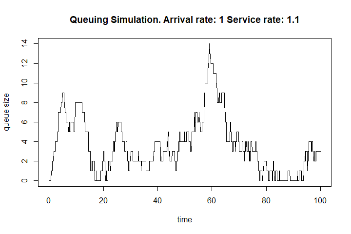<!-- -->

More correct version:

``` r
lambda <- 1     # arrival rate
mu <- 1.1       # service rate
t.end <- 100    # duration of simulation

queue <- timeline <- 0
i <- 1
while(timeline[i] < t.end){
  i <- i + 1
  arrival <- rexp(1, lambda + mu)
  timeline[i] <- timeline[i-1] + arrival
  
  if(runif(1) < lambda/(lambda + mu)) queue[i] <- queue[i-1] + 1
  else queue[i] <- max(0, queue[i-1] - 1)
  
}
plot(timeline, queue, type='s', xlab='time', ylab='queue size')
title(paste('Queuing Simulation. Arrival rate:', lambda,'Service rate:', mu))
```

<!-- -->

위 코드에서 대기열에서 고객이 도착하거나 떠나는지를 결정하는 부분은
다음과 같다.

- `runif(1) < lambda/(lambda + mu)`:

  - 0과 1 사이에서 난수를 생성하고, 고객이 도착할 확률을 계산한다.

    - 이 코드는 Poisson process의 merging, thinning 원리를 이용한다.

      - merging : `lambda + mu`

      - thinning : `lambda/(lambda + mu)`

    - `lambda`가 클수록 고객 도착 확률이 높다.

  - 이 조건이 참이면, 고객이 도착한다고 본다:
    `queue[i] <- queue[i-1] + 1`

  - 이 조건이 거짓이면, 고객이 서비스를 마치고 떠나는 것:
    `queue[i] <- max(0, queue[i-1] - 1)`

    - `max(0, queue[i-1] - 1)`는 대기열이 음수가 되지 않게 함.
